# Тема 2. Базовые операции языка Python
Отчет по Теме #2 выполнил(а):
- Ахметшин Данил Эдуардович
- ИВТ-22-1

| Задание | Лаб_раб | Сам_раб |
| ------ | ------ | ------ |
| Задание 1 | + | + |
| Задание 2 | + | + |
| Задание 3 | + | + |
| Задание 4 | + | + |
| Задание 5 | + | + |
| Задание 6 | + | + |
| Задание 7 | + | + |
| Задание 8 | + | + |
| Задание 9 | + | + |
| Задание 10 | + | + |

знак "+" - задание выполнено; знак "-" - задание не выполнено;

Работу проверили:
- к.э.н., доцент Панов М.А.

## Лабораторная работа №1
### Выведите в консоль три строки. Первая – любое число. Вторая – любое число в виде строки. Третья – любое число с плавающей точкой.

```python
print(123)
print('123')
print(1.23)
```
### Результат.
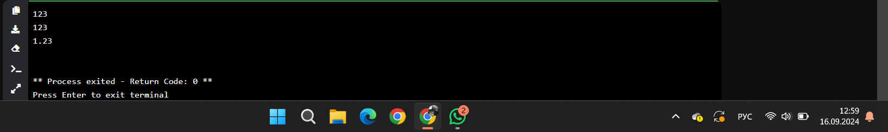

## Выводы
1. print(123) — выводит целое число 123. Это числовой тип данных int.
2. print('123') — выводит строку '123'. Строка обрамляется кавычками, что отличает её от числа.
3. print(1.23) — выводит число с плавающей точкой 1.23, это тип данных float (десятичное число).

## Лабораторная работа №2
### Выведите в консоль три строки. Первая – результат сложения или вычитания минимум двух переменных типа int. Вторая – результат сложения или вычитания минимум двух переменных типа float. Третья – результат сложения или вычитания минимум двух переменных типа int и float.
  
```python
print(1823 - 486)
print(5.1 + 8.27)
print(3 + 7.04 + 1 + 2.33)
```
### Результат.
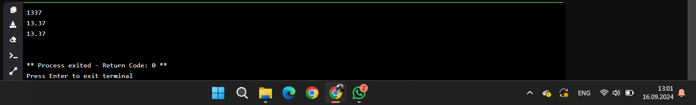

## Выводы
1. print(1823 - 486) — выполняется вычитание. Результат: 1337.
2. print(5.1 + 8.27) — выполняется сложение двух чисел с плавающей точкой. Результат: 13.37.
3. print(3 + 7.04 + 1 + 2.33) — сложение нескольких чисел, включая целые и с плавающей точкой

## Лабораторная работа №3
### Выведите в консоль три строки. Первая – обычная строка. Вторая – F строка с использованием заранее объявленной переменной. Третья – сложите две или более строк в одну.

```python
print('Привет, Мир!')
world = 'Мир'
print(f"Привет, {world}!")
one = 'Привет, '
two = 'Мир!'
print(one + two)
```
### Результат.
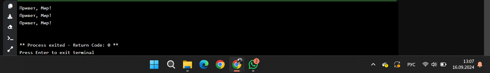

## Выводы
1. print('Привет, Мир!') — вывод строки напрямую.
2. world = 'Мир' — создаётся переменная world, в которую сохраняется строка 'Мир'.
3. f"Привет, {world}!" — использование f-строки. Переменная world подставляется внутрь строки.
4. one + two — происходит конкатенация (сложение) строк: 'Привет, ' + 'Мир!',
  
## Лабораторная работа №4
### Выведите в консоль три строки. Первая – трансформация любого типа переменной в bool. Вторая – трансформация любого типа переменной в float или int. Третья – трансформация любого типа переменной в str.

```python
one = "Hello"
print (bool(one))
two = 142
print(float(two))
three = None
print(str(three))
```
### Результат.
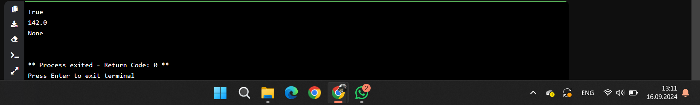

## Выводы
1. bool(one) — строка 'Hello' преобразуется в булево значение. Любая непустая строка в Python является True. Вывод: True.
2. float(two) — целое число 142 преобразуется в число с плавающей точкой: 142.0.
3. str(three) — значение None (означает отсутствие значения) преобразуется в строку 'None'.

## Лабораторная работа №5
### Присвойте трем переменным различные значения, воспользовавшись функцией input()

```python
one = input('one:')
two = input('two:')
three = input('three:')
print(one, two, three)
```
### Результат.
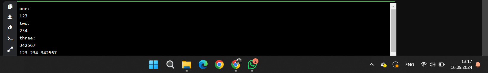

## Выводы
1. input('one:') — программа запрашивает ввод от пользователя с текстом one:. Все, что введёт пользователь, будет сохранено как строка в переменной one.
2. После ввода для всех переменных, выводится строка, содержащая значения переменных one, two и three.

## Лабораторная работа №6
### Создайте две любые числовые переменные и выполните над ними несколько математических операций: возведение в степень, обычное деление, целочисленное деление, нахождение остатка от деления. При желании вы можете проверить как работают эти вычисления с разными типами данных, например, сначала создать две переменные int, затем создать две переменные float и наконец создать переменные типа int и float и провести над ними операции, прописанные выше.

```python
a = 12
b = 5
print('Возведение в степень:', a ** b)
print('Обычное деление:', a / b)
print('Целочисленное деление:', a // b)
print('Нахождение остатка от деления:', a % b)
```
### Результат.
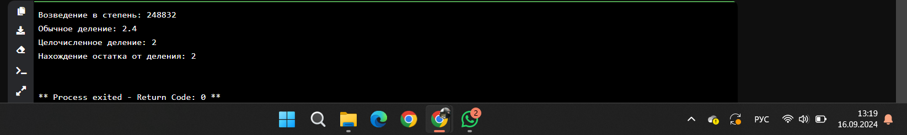

## Выводы
1. a ** b — возведение числа a в степень b (12 в степени 5). Результат: 248832.
2. a / b — обычное деление, результат: 2.4.
3. a // b — целочисленное деление, результатом будет только целая часть: 2.
4. a % b — остаток от деления (12 делим на 5, остаток — 2).

## Лабораторная работа №7
### Создайте любую строковую переменную и произведите над ней математическое действие умножение на любое число.

```python
line = 'Hello!'
print(line*6)
```
### Результат.
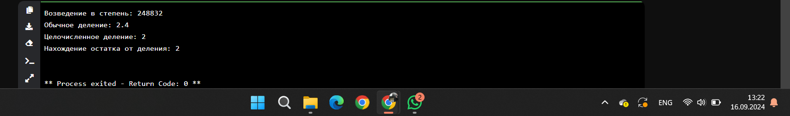

## Выводы
line * 6 — повторяет строку 'Hello!' 6 раз.

## Лабораторная работа №8
### Посчитайте сколько раз символ ‘o’ встречается в строке ‘Hello World’.

```python
sentence = 'Hello World'
print(sentence.count('o'))
```
### Результат.
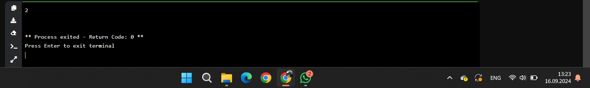

## Выводы
sentence.count('o') — метод count() подсчитывает количество вхождений символа 'o' в строке 'Hello World'. Результат: 2, потому что символ 'o' встречается дважды.

## Лабораторная работа №9
### Напишите предложение ‘Hello World’ в две строки. Написанная программа должна занимать одну строку в редакторе кода.

```python
print('Hello\nWorld')
```
### Результат.
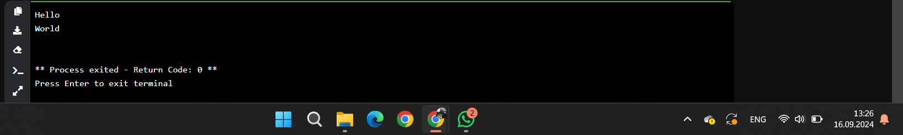

## Выводы
\n — это символ новой строки (перевод строки).

## Лабораторная работа №10
### Из предложения ‘Hello World’ выведите в консоль только 2 символ, а затем выведите слово ‘Hello’

```python
sentence = 'Hello World'
print(sentence[1])
print(sentence[:5])
```
### Результат.
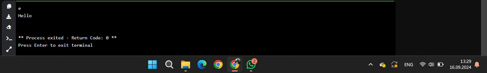

## Выводы
1. sentence[1] — обращение к символу по индексу 1. В строке 'Hello World' индексирование начинается с 0, поэтому символ с индексом 1 — это 'e'. Результат: e.
2. sentence[:5] — срез строки, начиная с 0-го символа до 5-го (не включая 5-й). Результат: 'Hello'.

## Самостоятельная работа №1
### Выведите в консоль булевую переменную False, не используя слово False в строке или изначально присвоенную булевую переменную. Программа должна занимать не более двух строк редактора кода.

```python
print(bool(0))
```
### Результат.
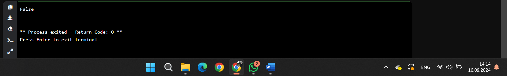

## Выводы
1. bool(0) — это преобразование числа 0 в булевое значение. В Python, 0 всегда интерпретируется как False, а любое ненулевое число — как True.
2. print(bool(0)) — выводит результат преобразования. То есть, программа выведет False.
  
## Самостоятельная работа №2
### Присвоить значения трем переменным и вывести их в консоль, используя только две строки редактора кода.

```python
a, b, c = 1, 2, 3
print(a, b, c)
```
### Результат.
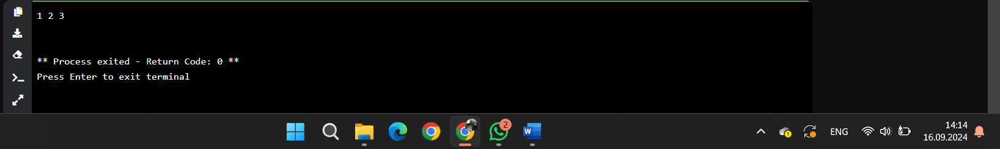

## Выводы
1. В первой строке происходит одновременное присвоение значений трём переменным: a = 1, b = 2, c = 3. Это удобный синтаксис для присвоения сразу нескольких переменных.
2. Во второй строке используется команда print(a, b, c) для вывода значений переменных через пробел
  
## Самостоятельная работа №3
### Реализуйте ввод данных в программу, через консоль, в виде только целых чисел (тип данных int). То есть при вводе буквенных символов в консоль, программа не должна работать. Программа должна занимать не более двух строк редактора кода. 

```python
a, b = map(int, input().split())
print(a, b)
```
### Результат.
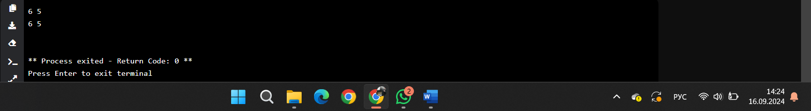

## Выводы
1. Функция input() считывает строку, введённую пользователем, из консоли.
2. Метод split() разбивает строку на отдельные элементы, разделённые пробелом.
3. Функция map() применяет указанную функцию (в данном случае int()) ко всем элементам списка, полученного из split().
4. Функция print(a, b) выводит значения переменных a и b, разделяя их пробелом.
  
## Самостоятельная работа №4
### Создайте только одну строковую переменную. Длина строки должна не превышать 5 символов. На выходе мы должны получить строку длиной не менее 16 символов. Программа должна занимать не более двух строк редактора кода.

```python
s = 'abcde'
print(s * (16 // len(s) + 1))
```
### Результат.
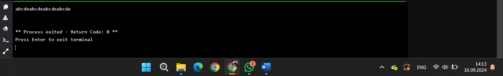

## Выводы
1. Переменная s = 'abcde' содержит строку длиной 5 символов.
2. len(s) — определяет длину строки (в данном случае 5 символов).
3. 16 // len(s) + 1 — мы считаем, сколько раз нужно повторить строку, чтобы получить строку длиной больше или равной 16 символов.
4. s * (число) — повторяет строку s необходимое количество раз
  
## Самостоятельная работа №5
### Создайте три переменные: день (тип данных - числовой), месяц (тип данных - строка), год (тип данных - числовой) и выведите в консоль текущую дату в формате: “Сегодня день месяц год. Всего хорошего!” используя F строку и оператор end внутри print(), в котором вы должны написать фразу “Всего хорошего!”. Программа должна занимать не более двух строк редактора кода.

```python
day, month, year = 16, 'сентябрь', 2024
print(f'Сегодня {day} {month} {year}.', end=' Всего хорошего!')
```
### Результат.
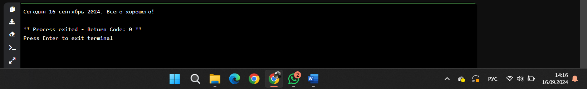

## Выводы
1. Переменные day, month, year содержат информацию о дне, месяце и годе.
2. f'Сегодня {day} {month} {year}.' — это f-строка, которая подставляет значения переменных прямо в строку.
3. end=' Всего хорошего!' — оператор end позволяет добавить дополнительный текст после вывода строки, без перехода на новую строку.
  
## Самостоятельная работа №6
### В предложении ‘Hello World’ вставьте ‘my’ между двумя словами. Выведите полученное предложение в консоль в одну строку. Программа должна занимать не более двух строк редактора кода.

```python
s = 'Hello World'
print(s.replace(' ', ' my '))
```
### Результат.
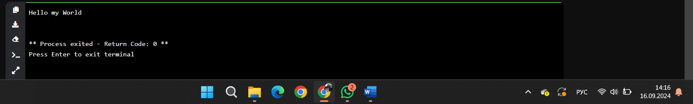

## Выводы
Мы используем метод строки replace(' ', ' my ') для замены пробела на слово my с пробелами по бокам.
  
## Самостоятельная работа №7
### Узнайте длину предложения ‘Hello World’, результат выведите в консоль. Программа должна занимать не более двух строк редактора кода. 

```python
s = 'Hello World'
print(len(s))
```
### Результат.


## Выводы
1. Переменная s содержит строку 'Hello World'.
2. len(s) — это функция, которая возвращает длину строки (включая пробелы).
  
## Самостоятельная работа №8
### Переведите предложение ‘HELLO WORLD’ в нижний регистр. Программа должна занимать не более двух строк редактора кода. 

```python
s = 'HELLO WORLD'
print(s.lower())
```
### Результат.
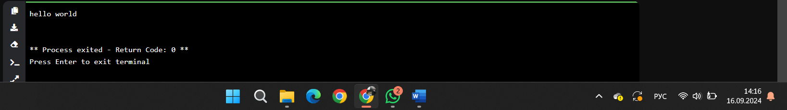

## Выводы
1. Строка 'HELLO WORLD' хранится в переменной s.
2. Метод строки lower() преобразует все символы в строке в нижний регистр.
  
## Самостоятельная работа №9
### Самостоятельно придумайте задачу по проходимой теме и решите ее. Задача должна быть связанна со взаимодействием с числовыми значениями.

```python
x = int(input())
print(x * 1.1)
```
### Результат.
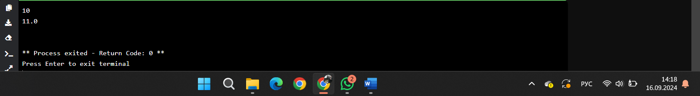

## Выводы
1. Сначала программа запрашивает ввод числа от пользователя с помощью input(). Мы используем int(), чтобы преобразовать ввод в целое число.
2. Затем программа умножает это число на 1.1, чтобы увеличить его на 10%.
  
## Самостоятельная работа №10
### Самостоятельно придумайте задачу по проходимой теме и решите ее. Задача должна быть связанна со взаимодействием со строковыми значениями.

```python
s = input()
print(s.replace(' ', '_'))
```
### Результат.
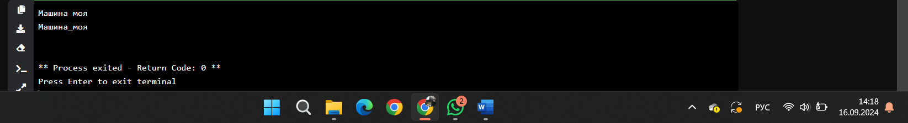

## Выводы
1. Программа запрашивает строку у пользователя.
2. Метод replace(' ', '_') заменяет все пробелы на символы подчёркивания.

## Общие выводы по теме
- Развернутый вывод
