# Тема 3. Операторы, условия, циклы
Отчет по Теме #3 выполнил(а):
- Ахметшин Данил Эдуардович
- ИВТ-22-1

| Задание | Лаб_раб | Сам_раб |
| ------ | ------ | ------ |
| Задание 1 | + | + |
| Задание 2 | + | + |
| Задание 3 | + | + |
| Задание 4 | + | + |
| Задание 5 | + | + |
| Задание 6 | + | - |
| Задание 7 | + | - |
| Задание 8 | + | - |
| Задание 9 | + | - |
| Задание 10 | + | - |

знак "+" - задание выполнено; знак "-" - задание не выполнено;

Работу проверили:
- к.э.н., доцент Панов М.А.

## Лабораторная работа №1
### Создайте две переменные, значение которых будете выводить через консоль. Также составьте условие, в котором созданные ранее переменные будут сравниваться, если условие выполняется, то выведите в консоль "Выполняется", если нет, то "Не выполняется".

```python
one = int(input('Введите значение первой переменной: '))
two = int(input('Введите значение второй переменной: ')) 
if one >= two:
    print('Выполняется')
else:
    print('Не выполняется')
```
### Результат.
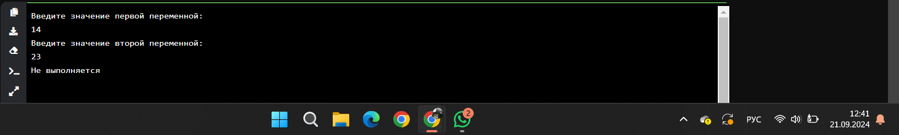

## Выводы
В данном коде проверяется равенство двух переменных с помощью операторов if/else, и, в зависимости от результата, выполняются соответствующие действия.

## Лабораторная работа №2
### Напишите программу, которая будет определять значения переменной меньше 0, больше 0 и меньше 10 или больше 10. Это нужно реализовать при помощи одной переменной, значение которой будет выводиться через консоль, а также при помощи конструкций if, elif, else.
  
```python
one = int(input('Введите значение переменной: '))
if one < 0:
    print('Переменная меньше 0')
elif 0 < one < 10:
    print('Переменная больше 0 и меньше 10')
else:
    print('Переменная больше 10')
```
### Результат.
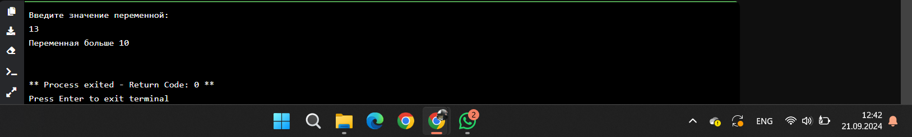

## Выводы
Конструкция elif позволяет рассмотреть больше 2-х условий.

## Лабораторная работа №3
### Напишите программу, в которой будет проверяться есть ли переменная в указательном массиве используя логический оператор in. Самостоятельно посмотрите, как работает программа со значениями, которых нет в массиве numbers.

```python
numbers = [1, 3, 4, 6, 8, 9]
value = int(input('Введите значение переменной: '))
if value in numbers:
    print('Переменная есть в данном массиве')
else:
    print('Переменной нет в этом массиве')
```
### Результат.
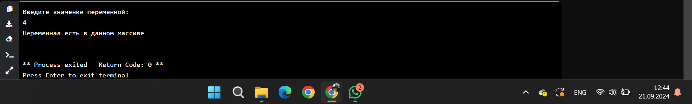

## Выводы
Оператор in ищет переменную среди элементов массива. С помощью if/else проверяется истинность условия, и выводятся соответствующие результаты.
  
## Лабораторная работа №4
### Напишите программу, которая будет определять находится ли переменная в указанном массиве и если да, то проверьте четная она или нет. Самостоятельно протестируйте данную программу с разными значениями переменной value.

```python
numbers = [1, 3, 4, 6, 8, 9, 15, 16, 73, 321, 322]
value = int(input('Введите значение переменной: '))
if value in numbers:
    if value % 2 == 0:
        print('Переменная четная и есть в массиве numbers')
    else:
        print('Переменная нечетная и есть в массиве numbers')
else:
    print(f"Переменной нет в массиве numbers и она равна {value}")
```
### Результат.
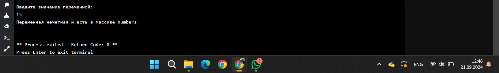

## Выводы
С помощью оператора in в основной конструкции if проверяется, есть ли переменная в массиве, а вложенная конструкция if value%2==0: определяет, четное число или же нет.

## Лабораторная работа №5
### Напишите программу, в которой циклом for значения переменной i будут меняться от 0 до 10 и посмотрите, как разные виды сравнений и операций работают в цикле.
```python
for i in range(10):
    print('i = ',i)
    if i == 0:
        i+=2
    if i == 1:
        continue
    if i == 2 or i == 3:
        print (i, ' равно 2 или 3')
    elif i in [4, 5, 6]:
        print (i, ' равно 4, 5 или 6')
    else:
        break
```
### Результат.
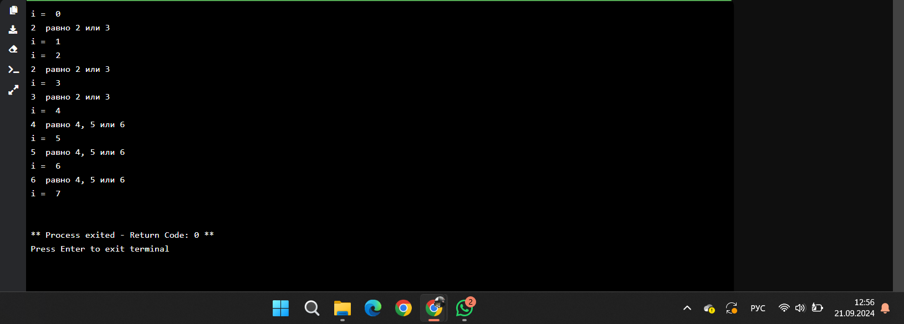


## Выводы
1. `if i == 0` при истинном значении выполняет код внутри конструкции
2. `continue` продолжает выполнение кода
3. `elif i in [4, 5, 6]:` при совпадении i и одного из элементов массива выполняет код внутри конструкции
4. `break` завершает компиляцию кода
5. `for i in range(10):` перебирает все числа от 0 до того, которое указано в range()

## Лабораторная работа №6
### Напишите программу, в которой при помощи цикла for определяется есть ли переменная value в строке string и посмотрите, как работает оператор else для циклов. Самостоятельно посмотрите, что выведет программа, если значение переменной value оказалось в строке string.
```python
string = "Привет всем изучающим Python!"
value = input()
for i in string:
    if i == value:
        index = string.find(value)
        print(f"Буква '{value}' есть в строке под {index} индексом")
        breakЁ
else:
    print(f"Буквы '{value}' нет в указанной строке")
```
### Результат.
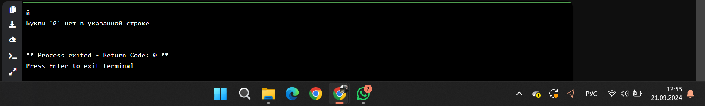

## Выводы
1. `for i in a:` запускается цикл
2. `if i == b:` i присваевается значение b
3. `index = a.find(b)` index делит строку на символы и сравнивает каждую со значением b

## Лабораторная работа №7
### Напишите программу, в которой вы наглядно посмотрите, как работает цикл for проходя в обратном порядке, то есть, к примеру не от 0 до 10, а от 10 до 0. В уже готово  программе показано вычитание из 100, а вам во время реализации программы будет необходимо придумать свой вариант применения обратного цикла.
```python
value = 100
for i in range(10,-1, -1):
    value -= i
    print(i, value)
```
### Результат.
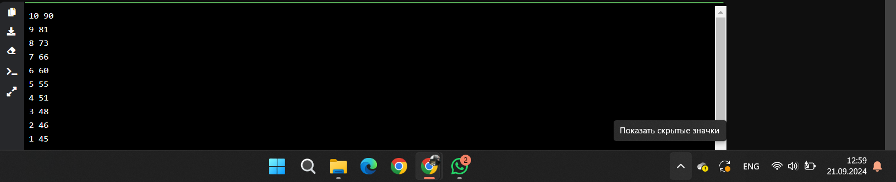


## Выводы
В данном коде все i помещаются в массив arr, а массив, в свою очередь, выводится в обратном порядке с помощью reversed

## Лабораторная работа №8
### Напишите программ используя цикл whilе, внутри которого есть какие-либо проверки, но быть осторожным, поскольку циклы whilе при неправильно написанных условиях могут становиться бесконечными, как указано в примере далее.

```python
value = 0
while value < 100:
    if value == 0:
        value += 10
    elif value // 5 > 1:
        value *= 5
    else:
        value -= 5
    print(value)
```
### Результат.
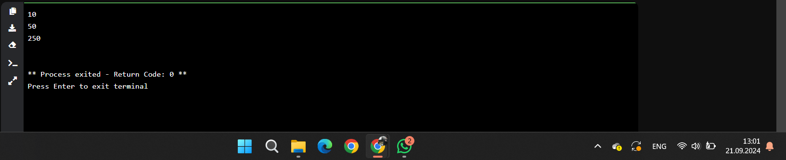


## Выводы
Цикл while будет повторять выполнение одного и того же условия, пока оно не перестанет быть истинным

## Лабораторная работа №9
### Напишите программу с использованием вложенных циклов и одной проверкой внутри них. Самое главное, не забудьте, что нельзя использовать одинаковые имена итерируемых переменных, когда вы используете вложенные циклы.

```python
value = 0
for i in range(10):
    for j in range(10):
        if i != j:
            value += j
        else:
            pass
print(value)
```
### Результат.
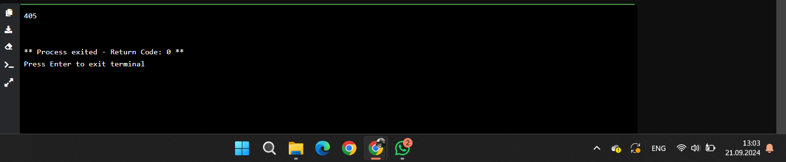


## Выводы
При использовании вложенных циклов проверяются сразу 2 значения

## Лабораторная работа №10
### Напишите программу с использованием flag, которое будет определять есть ли нечетное число в массиве. В данной задаче flag выступает в роли индикатора встречи нечетного числа в исходном массиве, четных чисел.

```python
even_array = [2, 4, 6, 8, 9]
flag = False
for value in even_array:# Запуск проверки на четное число
    if value % 2 == 1:
            flag = True
if flag is True:
    print('B массиве есть нечетное число')
else:
    print('B массиве все числа четные')
```
### Результат.
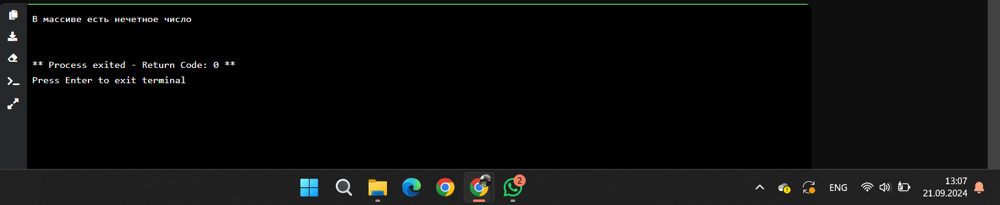


## Выводы
С помощью flag можно проверять соответствие определенному условию


## Самостоятельная работа №1
Напишите программу, которая преобразует 1 в 31.
Для выполнения поставленной задачи необходимо обязательно и только 1 раз использовать:
• цикл for
• *=5
• +=1
Никаких других действий или циклов использовать нельзя.
```python
x = 6
for i in range(1):
    x *= 5
x += 1
print(x)
```
### Результат.
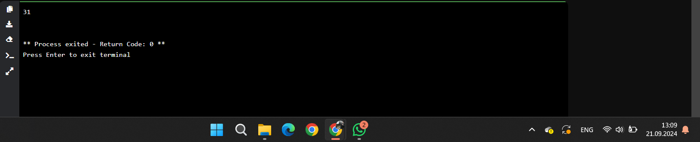

## Выводы
Цикл выполняется 1 раз, умножая х на 6, вне цикла добавляется 1.

## Самостоятельная работа №2
### Напишите программу, которая выводит фразу "Hello World" в обратном порядке, и каждая буква находится в одной строке консоли.
```python
a = "Hello World"
b = a[::-1]
for i in range(len(b)):
    print(b[i])
```
### Результат.
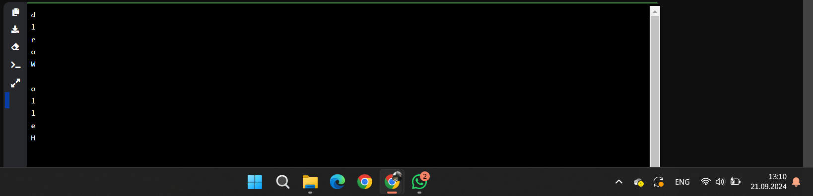


## Выводы
С помощью срезов переворачиваем строку, а в цикле выводим каждую букву в отдельную строку

## Самостоятельная работа №3
Напишите программу, на вход которой поступает значение из конслоли, оно должно быть числовым в диапазоне от 0 до 10 включительно. Если вводимое число не подходит по требованиям, то необходимо вывести оповещение об этом в консоль и остановить программу. Код должен вычислять в каком диапазоне находится полученное число. Нужно учитывать три диапазона:
• от 0 до 3 включительно
• от 3 до 6
• от 6 до 10 включительно
Программа должна занимать не более 10 строчек в редакторе кода
```python
a = int(input())
if 0<=a and a<=3:
    print(a, ' в диапазоне от 0 до 3 включительно')
elif 3<=a and a<=6:
    print(a, ' в диапазоне от 3 до 6 включительно')
elif 6<=a and a<=10:
    print(a, ' в диапазоне от 6 до 10 включительно')
```
### Результат.
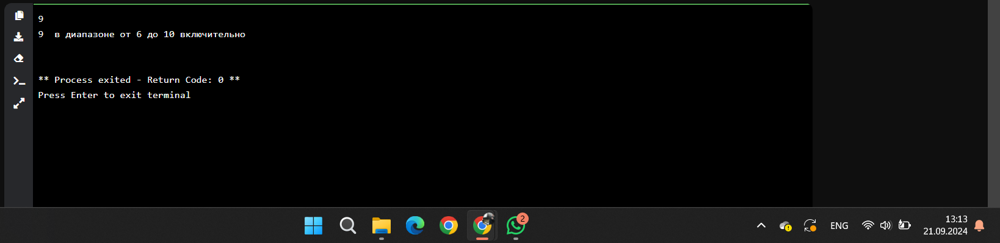


## Выводы
С помощью конструкций if/elif/else проверяется соответствие переменной и разных диапазонов

## Самостоятельная работа №4
Манипулирование строками. Напишите программу на Python, которая принимает предложение в качестве входных данных от пользователя. Выполните следующие операции и отобразите результаты:
• Выведите длину предложения
• Переведите предложение в нижний регистр
• Посчитайте количество гласных в предложении
• Замените все слова ugly на beauty
• Проверьте, начинается ли предложение с "The" и заканчивается ли на "end"
```python
a = 'The end was ugly end'
print('Длина предложения: ', len(a))
b = a.lower()
print('Строка в нижнем регистре: ', b)
c = 'aeiou'
count = sum(1 for char in b if char in c)
print('Количество гласных: ', count)
replace = b.replace('ugly', 'beauty')
print("Предложение с заменой 'ugly' на 'beauty':", replace)
start = a.startswith("The")
end = a.endswith("end")
if start == True and end == True:
    print ('Предложение начинается на The и заканчивается на end: ')
```
### Результат.
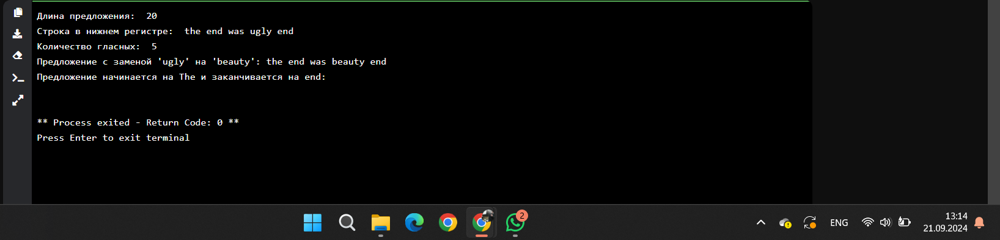

## Выводы
1. С помощью `len(a)` вычисляется длина строки
2. Функция `b.replace` заменяет слово 'ugly' на 'beauty'
3. `start = a.startswith("The")` и `end = a.endswith("end")` - это флаги, истинность которых мы проверяем в конструкции `if start == True and end == True:`
   
## Самостоятельная работа №5
Создайте программу, результатом которой будет данный вывод в консоль:


Программу нужно составить из данных фрагрментов кода:


Строки кода можно использовать только один раз. Не обязательно использовать все строки кода.
```python
string = 'hello'
memory = ' world'
counter = 4
while ' world' not in string:
    print (string + memory)
    print(string)
    if counter > 7:
        string = string + ' world'
        print (string)
    counter += 1
```
### Результат.
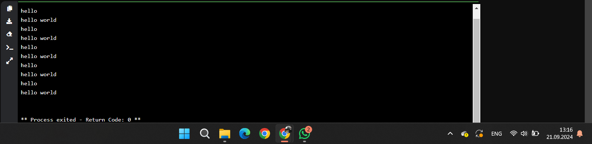


## Выводы
Добавление `' world'` к string завершает цикл, т.к. условие цикла `while ' world' not in string:`

## Общие выводы по теме
В данной теме были изучены базовые навыки работы с операторами, условиями и циклами в Python.
1. Операторы Python:
   - in проверяет наличие некоторой переменной в массиве/строке
   - flag проверяет несоответствие условию
   - continue, при верном условии, продолжает работу программы
   - break при соответствии условия завершает работу программы
2. Условия Python:
   if, else, elif позволяют проверять различные условия, которым может соответствовать переменная, и выводить соответствующие результаты в зависимости от ее значения
3. Циклы в Python:
   - for имеет четкие условия, используется как счетчик чисел, и завершается, когда счетчик доходит до максимального числа цикла
   - В while можно поставить любое условие, при котором цикл будет продолжаться
