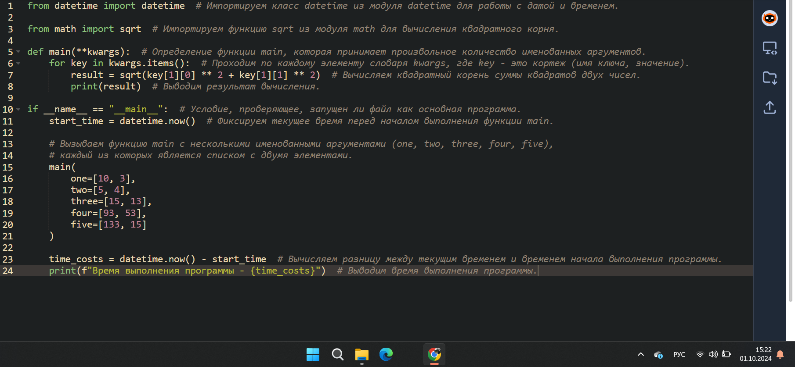

# Тема 4. Функции и стандартные модули/библиотеки
Отчет по Теме #4 выполнил(а):
- Ахметшин Данил Эдуардович
- ИВТ-22-1

| Задание | Лаб_раб | Сам_раб |
| ------ | ------ | ------ |
| Задание 1 | + | + |
| Задание 2 | + | + |
| Задание 3 | + | + |
| Задание 4 | + | + |
| Задание 5 | + | + |
| Задание 6 | + | - |
| Задание 7 | + | - |
| Задание 8 | + | - |
| Задание 9 | + | - |
| Задание 10 | + | - |

знак "+" - задание выполнено; знак "-" - задание не выполнено;

Работу проверили:
- к.э.н., доцент Панов М.А.

## Лабораторная работа №1
### Напишите функцию, которая выполняет любые арифметические действия и выводит результат в консоль. Вызовите функцию используя “точку входа”. 

```python
def main():
    print(2+2)
if __name__ == '__main__':
    main()
```
### Результат.


## Выводы
Выводит результат операции сложения 2 + 2, который равен 4.

## Лабораторная работа №2
### Напишите функцию, которая выполняет любые арифметические действия, возвращает при помощи return значение в место, откуда вызывали функцию. Выведите результат в консоль. Вызовите функцию используя “точку входа”. 
  
```python
def main():
    result = 2 + 2
    return result
if __name__ == '__main__':
    answer = main()
    print(answer)
```
### Результат.


## Выводы
Результат сложения 2 + 2 сохраняется в переменной result, и эта переменная возвращается и выводится в main(). Вывод также будет 4.

## Лабораторная работа №3
### Напишите функцию, в которую передаются два аргумента, над ними производится арифметическое действие, результат возвращается туда, откуда эту функцию вызывали. Выведите результат в консоль. Вызовите функцию в любом небольшом цикле. 

```python
def main(one, two): 
    return one + two
for i in range(5):
    answer = main(one=1, two=10)
    print(answer)
```
### Результат.


## Выводы
main() возвращает сумму двух аргументов one и two. В цикле выводится результат 5 раз, и каждый раз это сумма 1 и 10, то есть 11.
  
## Лабораторная работа №4
### Напишите функцию, на вход которой подается какое-то изначальное неизвестное количество аргументов, над которыми будет производится арифметические действия. Для выполнения задания необходимо использовать кортеж “*args”. 

```python
def main(x, *args):
    one = x 
    two = sum(args)
    three = float(len(args))
    print(f"one={one}\ntwo={two}\nthree={three}")
    return x + sum(args) / float(len(args))
if __name__ == '__main__':
    result = main(10, 0, 1, 2, -1, 0, -1, 1, 2)
    print(f"\nresult={result}")
```
### Результат.


## Выводы
Функция выводит значения переменных one (первый аргумент), two (сумма остальных аргументов) и three (длина списка аргументов). Затем возвращает результат деления суммы на количество элементов. Вывод будет подробный с данными аргументами, а итоговый результат 10.5.

## Лабораторная работа №5
### Напишите функцию, которая на вход получает кортеж “**kwargs” и при помощи цикла выводит значения, поступившие в функцию. На скриншоте ниже указаны два варианта вызова функции с “**kwargs” и два варианта работы с данными, поступившими в эту функцию. Комментарии в коде и теоретическая часть помогут вам разобраться в этом нелегком аспекте. Вызовите функцию используя “точку входа”. 

```python
def main(**kwargs):
    for i in kwargs.items():
        print(i[0], i[1])
    print()
    for key in kwargs:
        print(f"{key} = {kwargs[key]}")
if __name__ == '__main__':
    main(x=[1, 2, 3], y=[3, 3, 0], z=[2, 3, 0], q=[3, 3, 0], w=[3, 3, 0]) 
    print()
    main(**{'x': [1, 2, 3], 'y': [3, 3, 0]})
```
### Результат.


## Выводы
Выводятся пары "ключ-значение" переданных аргументов kwargs. Код выводит все переданные ключи и значения, а затем повторяет это в другом формате.

## Лабораторная работа №6
### Напишите две функции. Первая – получает в виде параметра “**kwargs”. Вторая считает среднее арифметическое из значений первой функции. Вызовите первую функцию используя “точку входа” и минимум 4 аргумента. 
```python
def main(**kwargs):
    for i, j in kwargs.items():
        print(f"{i}. Mean = {mean(j)}")

def mean(data):
    return sum(data) / float(len(data))
if __name__ == '__main__':
    main(x=[1, 2, 3], y=[3, 3, 0])
```
### Результат.


## Выводы
Выводится среднее значение для каждого переданного списка данных с использованием функции mean(). Например, для x=[1, 2, 3] вывод будет x. Mean = 2.0.

## Лабораторная работа №7
### Создайте дополнительный файл .py. Напишите в нем любую функцию, которая будет что угодно выводить в консоль, но не вызывайте ее в нем. Откройте файл main.py, импортируйте в него функцию из нового файла и при помощи “точки входа” вызовите эту функцию. 

```python
from for_import import say_hello

if __name__ == '__main__':
    say_hello()

def say_hello():
    print('Hello studentds!')
```
### Результат.


## Выводы
Импортирует функцию say_hello и вызывает её, выводя на экран строку Hello students!.

## Лабораторная работа №8
### Напишите программу, которая будет выводить корень, синус, косинус полученного от пользователя числа. 

```python
import math

def main():
    value = int(input('Введите значение:'))
    print(math.sqrt(value))
    print(math.sin(value))
    print(math.cos(value))
if __name__ == '__main__':
    main()
```
### Результат.


## Выводы
Запрашивает ввод числа и выводит его квадратный корень, синус и косинус с помощью функций из библиотеки math.

## Лабораторная работа №9
### Напишите программу, которая будет рассчитывать какой день недели будет через n-нное количество дней, которые укажет пользователь. 

```python
from datetime import datetime as dt 
from datetime import timedelta as td 

def main():
    print( 
        f"Сегодня {dt.today().date()}. "
        f"День недели - {dt.today().isoweekday()}"
    )
    n = int(input('Введите количество дней: ')) 
    today = dt.today()
    result = today + td(days=n) 
    print(
        f"Через {n} дней будет {result.date()}. " 
        f"День недели - {result.isoweekday()}"
    )
    
if __name__ == '__main__':
    main()
```
### Результат.


## Выводы
Выводит сегодняшнюю дату и день недели. Затем запрашивает количество дней для вычисления новой даты и выводит её, а также день недели для полученной даты.

## Лабораторная работа №10
### Напишите программу с использованием глобальных переменных, которая будет считать площадь треугольника или прямоугольника в зависимости от того, что выберет пользователь. Получение всей необходимой информации реализовать через input(), а подсчет площадей выполнить при помощи функций. Результатом программы будет число, равное площади, необходимой фигуры. 

```python
global result

def rectangle():
    a = float(input("Ширина: ")) 
    b = float(input("Высота: ")) 
    global result 
    result = a * b
    
def triangle():
    a = float(input("Основание: "))
    h = float(input("Высота: "))
    global result
    result = 0.5 * a * h
    
figure = input("1-прямоугольник, 2-треугольник: ")

if figure == '1': 
    rectangle()
elif figure == '2':
    triangle()
    
print(f"Площадь: {result}")
```
### Результат.


## Выводы
Рассчитывает площадь либо прямоугольника, либо треугольника в зависимости от выбора пользователя и выводит результат.

## Самостоятельная работа №1
### Дайте подробный комментарий для кода, написанного ниже. Комментарий нужен для каждой строчки кода, нужно описать что она делает. Не забудь те, что функции комментируются по-особенному. 

```python
from datetime import datetime  # Импортируем класс datetime из модуля datetime для работы с датой и временем.

from math import sqrt  # Импортируем функцию sqrt из модуля math для вычисления квадратного корня.

def main(**kwargs):  # Определение функции main, которая принимает произвольное количество именованных аргументов.
    for key in kwargs.items():  # Проходим по каждому элементу словаря kwargs, где key - это кортеж (имя ключа, значение).
        result = sqrt(key[1][0] ** 2 + key[1][1] ** 2)  # Вычисляем квадратный корень суммы квадратов двух чисел.
        print(result)  # Выводим результат вычисления.

if __name__ == "__main__":  # Условие, проверяющее, запущен ли файл как основная программа.
    start_time = datetime.now()  # Фиксируем текущее время перед началом выполнения функции main.
    
    # Вызываем функцию main с несколькими именованными аргументами (one, two, three, four, five),
    # каждый из которых является списком с двумя элементами.
    main(
        one=[10, 3],
        two=[5, 4],
        three=[15, 13],
        four=[93, 53],
        five=[133, 15]
    )

    time_costs = datetime.now() - start_time  # Вычисляем разницу между текущим временем и временем начала выполнения программы.
    print(f"Время выполнения программы - {time_costs}")  # Выводим время выполнения программы.

```
### Результат.


## Выводы
Вычисляет и выводит расстояние (евклидово расстояние) между двумя точками, заданными списками чисел (x, y), для каждого переданного аргумента. В конце выводится время выполнения программы.
  
## Самостоятельная работа №2
### Напишите программу, которая будет заменять игральную кость с 6 гранями. Если значение равно 5 или 6, то в консоль выводится «Вы победили», если значения 3 или 4, то вы рекурсивно должны вызвать эту же функцию, если значение 1 или 2, то в консоль выводится «Вы проиграли». При этом каждый вызов функции необходимо выводить в консоль значение “кубика”. Для выполнения задания необходимо использовать стандартную библиотеку random. Программу нужно написать, используя одну функцию и “точку входа” 

```python
import random

def roll_dice():
    dice = random.randint(1, 6) 
    print(f"Кубик показывает: {dice}") 

    if dice in [5, 6]:
        print("Вы победили")
    elif dice in [3, 4]:
        roll_dice()
    else:
        print("Вы проиграли")

if __name__ == "__main__":
    roll_dice()

```
### Результат.


## Выводы
Симулирует бросок кубика. Если выпадает 5 или 6 — пользователь побеждает, если 3 или 4 — бросок повторяется, если 1 или 2 — проигрыш.
  
## Самостоятельная работа №3
### Напишите программу, которая будет выводить текущее время, с точностью до секунд на протяжении 5 секунд. Программу нужно написать с использованием цикла. Подсказка: необходимо использовать модуль datetime и time, а также вам необходимо как-то “усыплять” программу на 1 секунду.

```python
from datetime import datetime 
import time 

def print_time(): 
    for _ in range(5): 
        now = datetime.now().strftime("%H:%M:%S") 
        print(f"Текущее время: {now}") 
        time.sleep(1)

if __name__ == "__main__":
    print_time()

```
### Результат.


## Выводы
Выводит текущее время в формате часов, минут и секунд с паузой в 1 секунду между каждым выводом, повторяя это 5 раз.
  
## Самостоятельная работа №4
### Напишите программу, которая считает среднее арифметическое от аргументов вызываемое функции, с условием того, что изначальное количество этих аргументов неизвестно. Программу необходимо реализовать используя одну функцию и “точку входа”. 
```python
def average(*args):
    if len(args) == 0:
        return 0 
    return sum(args) / len(args)

if __name__ == "__main__":
    print(average(1, 2, 3, 4, 5)) 
    print(average(10, 20, 30))

```
### Результат.


## Выводы
Вычисляет среднее значение для переданных чисел. Если аргументы отсутствуют, возвращает 0.
  
## Самостоятельная работа №5
### Создайте два Python файла, в одном будет выполняться вычисление площади треугольника при помощи формулы Герона (необходимо реализовать через функцию), а во втором будет происходить взаимодействие с пользователем (получение всей необходимой информации и вывод результатов). Напишите эту программу и выведите в консоль полученную площадь. 

## Файл 1: Main.py
```python
from heron_formula import triangle_area

if __name__ == "__main__":
    a = float(input("Введите длину первой стороны треугольника: "))
    b = float(input("Введите длину второй стороны треугольника: "))
    c = float(input("Введите длину третьей стороны треугольника: "))
    
    area = triangle_area(a, b, c) 
    print(f"Площадь треугольника: {area}")
```
## Файл 2: Heron_formula.py
```python
import math

def triangle_area(a, b, c):
    s = (a + b + c) / 2
    return math.sqrt(s * (s - a) * (s - b) * (s - c))
```

### Результат.


## Выводы
Запрашивает длины сторон треугольника и вычисляет его площадь по формуле Герона.

## Общие выводы по теме
Тема 4. Функции и стандартные модули/библиотеки охватывают широкий спектр возможностей Python, от базовых вычислений и работы с аргументами до более сложных задач, таких как работа с датами и временем, использование случайных чисел и реализация алгоритмов.
