# Тема 5. Базовые коллекции: множества, списки
Отчет по Теме #5 выполнил(а):
- Ахметшин Данил Эдуардович
- ИВТ-22-1

| Задание | Лаб_раб | Сам_раб |
| ------ | ------ | ------ |
| Задание 1 | + | + |
| Задание 2 | + | + |
| Задание 3 | + | + |
| Задание 4 | + | + |
| Задание 5 | + | + |
| Задание 6 | + | - |
| Задание 7 | + | - |
| Задание 8 | + | - |
| Задание 9 | + | - |
| Задание 10 | + | - |

знак "+" - задание выполнено; знак "-" - задание не выполнено;

Работу проверили:
- к.э.н., доцент Панов М.А.

## Лабораторная работа №1
### Друзья предложили вам поиграть в игру “найди отличия и убери повторения (версия для программистов)”. Суть игры состоит в том, что на вход программы поступает два множества, а ваша задача вывести все элементы первого, которых нет во втором. А вы как раз недавно прошли множества и знаете их возможности, поэтому это не составит для вас труда. 

```python
set_1 = {'White', 'Black', 'Red', 'Pink'}
set_2 = {'Red', 'Green', 'Blue', 'Red'}
print(set_1 - set_2)
```
### Результат.


## Выводы
Операция set_1 - set_2 возвращает разность множеств, то есть элементы, которые есть в set_1, но отсутствуют в set_2.

## Лабораторная работа №2
### Напишите две одинаковые программы, только одна будет использовать set(), а вторая frozenset() и попробуйте к исходному множеству добавить несколько элементов, например, через цикл.
Вариант с set():
```python
a = set('abcdefg')
print(a)
for i in range(1, 5):
    a.add(i)
print(a)
```
### Результат.
.png)

### А вот что произойдет, если вы попробуете добавить новый элемент в frozenset(): 
```python
a = frozenset('abcdefg')
print(a)
for i in range(1, 5):
    a.add(i)
print(a)
```
### Результат.
.png)

## Выводы
При set() cначала создается множество из символов строки 'abcdefg'. Затем в это множество добавляются элементы от 1 до 4. Множество frozenset неизменяемо, поэтому при попытке использовать метод add() возникнет ошибка AttributeError, так как у объектов типа frozenset нет метода add().

## Лабораторная работа №3
### На вход в программу поступает список (минимальной длиной 2 символа). Напишите программу, которая будет менять первый и последний элемент списка. 
```python
def replace(input_list):
    memory = input_list[0]
    input_list[0] = input_list[-1]
    input_list[-1] = memory
    return input_list
print(replace([1, 2, 3, 4, 5]))
```
### Результат.
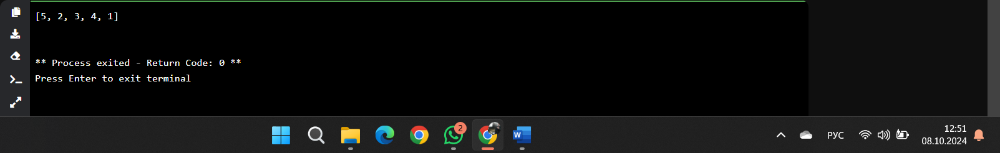

## Выводы
Функция меняет местами первый и последний элементы списка. В примере список [1, 2, 3, 4, 5] преобразуется в [5, 2, 3, 4, 1].
  
## Лабораторная работа №4
### На вход в программу поступает список (минимальной длиной 10)

```python
a = [12, 54, 32, 57, 843, 2346, 765, 75, 25, 234, 756, 23] 
print(a[2:6])
```
### Результат.
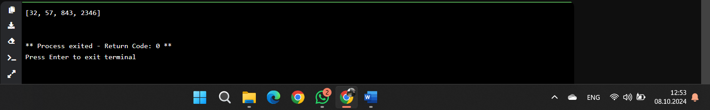

## Выводы
Срез списка возвращает элементы с индексами 2, 3, 4 и 5

## Лабораторная работа №5
### Иван задумался о поиске «бесполезного» числа, полученного из списка. Суть поиска в следующем: он берет произвольный список чисел, находит самое большое из них, а затем делит его на длину списка. Студент пока не придумал, где может пригодиться подобное значение, но ищет у вас помощи в реализации такой функции useless(). 

```python
def useless(lst):
    return max(lst) / len(lst)
    
print(useless([3, 5, 7, 3, 33]))
print(useless([-12.5, 54, 77.3, 0, -36, 98.2, -63, 21.7, 47, -89.6]))
print(useless([-25.8, 86, 12.5, -56, 73.2, 0, 43, -91.5, 65.9, -7]))
```
### Результат.
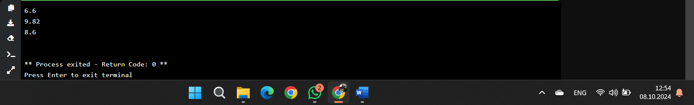

## Выводы
Функция возвращает результат деления максимального элемента на длину списка:
- Для списка [3, 5, 7, 3, 33] результат будет 33 / 5 = 6.6.
- Для списка [-12.5, 54, 77.3, 0, -36, 98.2, -63, 21.7, 47, -89.6] результат будет 98.2 / 10 = 9.82.
- Для списка [-25.8, 86, 12.5, -56, 73.2, 0, 43, -91.5, 65.9, -7] результат будет 86 / 10 = 8.6.

## Лабораторная работа №6
### Ребята не могут определится каким супергероем они хотят стать. У них есть случайно составленный список супергероев, и вы должны определить кто из ребят будет каким супергероем. Необходимо использовать разделение списков символов). Напишите программу, которая выводит элементы с индексами от 2 до 6. В программе необходимо использовать “срез”.

```python
superheroes =['superman','spiderman','batman']
nikolay, vasiliy, ivan = superheroes
print('Николай -' ,nikolay)
print('Василий - ', vasiliy)
print('Иван -', ivan)
```
### Результат.
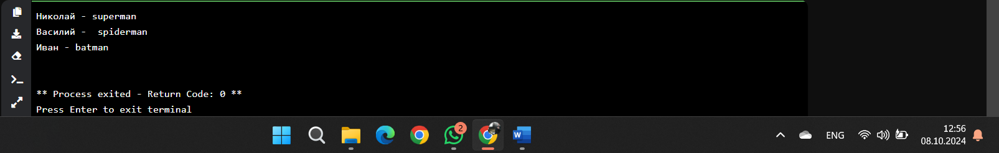

## Выводы
Список супергероев распаковывается в три переменные.

## Лабораторная работа №7
### Вовочка, насмотревшись передачи “Слабое звено” решил написать программу, которая также будет находить самое слабое звено (минимальный элемент) и удалять его, только делать он это хочет не с людьми, а со списком. Помогите Вовочке с реализацией программы. 

```python
a = [-25.8, 86, 12.5, -56, 73.2, 0, 43, -91.5, 65.9, -7]
a.sort()
print('Отсортированный список: \n', a)
a.pop(0)
print('Отсортированный список без наименьшего элемента:\n', a)
```
### Результат.
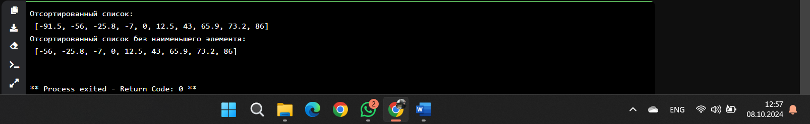

## Выводы
После сортировки список выглядит так: [-91.5, -56, -25.8, -7, 0, 12.5, 43, 65.9, 73.2, 86]. После удаления минимального элемента результат будет: [-56, -25.8, -7, 0, 12.5, 43, 65.9, 73.2, 86].

## Лабораторная работа №8
### Михаил решил создать большой n-мерный список, для этого он случайным образом создал несколько списков, состоящих минимум из 3, а максимум из 10 элементов и поместил их в один большой список. Он также как и Иван не знает зачем ему это сейчас нужно, но надеется на то, что это пригодится ему в будущем. 

```python
from random import randint
def list_maker():
    a = [randint(1, 100)] * randint(3, 10) 
    return a
if __name__ == '__main__':
    result = []
    for i in range(randint(1, 5)): 
        result.append(list_maker())
print(result)
```
### Результат.
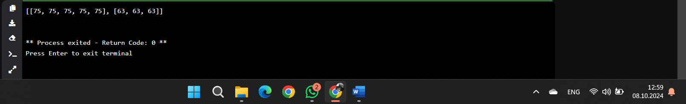

## Выводы
Функция list_maker создает список, состоящий из одинаковых случайных чисел. Количество элементов в списке также случайное. В результате программа выводит список списков случайной длины и с одинаковыми значениями.

## Лабораторная работа №9
### Вы работаете в ресторане и отвечает за статистику покупок, ваша задача сравнить между собой заказы покупателей, которые указаны в разном порядке. Реализуйте функцию superset(), которая принимает 2 множества. Результат работы функции: вывод в консоль одного из сообщений в зависимости от ситуации: 
1  - «Супермножество не обнаружено» 
2  – «Объект {X} является чистым супермножеством» 
3  – «Множества равны» 

```python
def superset(set_1, set_2):
    if set_1 > set_2:
        print(f'Объект {set_1} является чистым супермножеством')
    elif set_1 == set_2:
        print(f'Множества равны')
    elif set_1 < set_2:
        print(f'Объект {set_2} является чистым супермножеством') 
    else:
        print('Супермножество не обнаружено')
if __name__ == '__main__': 
    superset({1, 8, 3, 5}, {3, 5})
    superset({1, 8, 3, 5}, {5, 3, 8, 1})
    superset({3, 5}, {5, 3, 8, 1}) 
    superset({90, 100}, {3, 5})
```
### Результат.
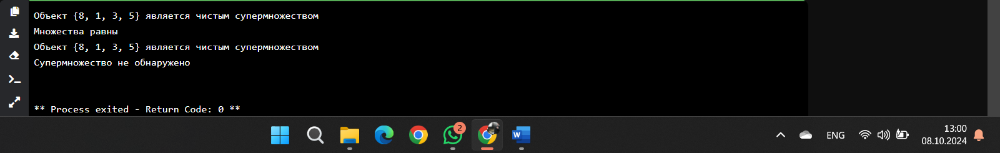

## Выводы
Функция проверяет, является ли одно множество супермножеством другого, выводит результаты для разных пар множеств.

## Лабораторная работа №10
### Предположим, что вам нужно разобрать стопку бумаг, но нужно начать работу с нижней, “переверните стопку”. Вам дан произвольный список. Представьте его в обратном порядке. Программа должна занимать не более двух строк в редакторе кода. 

```python
my_list = [2, 5, 8, 3]
print (my_list[::-1])
```
### Результат.
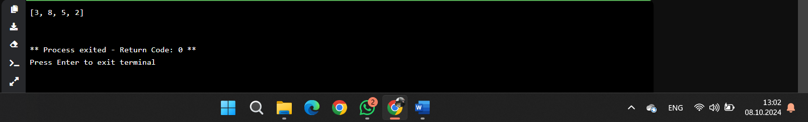

## Выводы
Оператор среза [::-1] переворачивает список.

## Самостоятельная работа №1
### Дайте подробный комментарий для кода, написанного ниже. Комментарий нужен для каждой строчки кода, нужно описать что она делает. Не забудь те, что функции комментируются по-особенному. 

```python
from datetime import datetime  # Импортируем класс datetime из модуля datetime для работы с датой и временем.

from math import sqrt  # Импортируем функцию sqrt из модуля math для вычисления квадратного корня.

def main(**kwargs):  # Определение функции main, которая принимает произвольное количество именованных аргументов.
    for key in kwargs.items():  # Проходим по каждому элементу словаря kwargs, где key - это кортеж (имя ключа, значение).
        result = sqrt(key[1][0] ** 2 + key[1][1] ** 2)  # Вычисляем квадратный корень суммы квадратов двух чисел.
        print(result)  # Выводим результат вычисления.

if __name__ == "__main__":  # Условие, проверяющее, запущен ли файл как основная программа.
    start_time = datetime.now()  # Фиксируем текущее время перед началом выполнения функции main.
    
    # Вызываем функцию main с несколькими именованными аргументами (one, two, three, four, five),
    # каждый из которых является списком с двумя элементами.
    main(
        one=[10, 3],
        two=[5, 4],
        three=[15, 13],
        four=[93, 53],
        five=[133, 15]
    )

    time_costs = datetime.now() - start_time  # Вычисляем разницу между текущим временем и временем начала выполнения программы.
    print(f"Время выполнения программы - {time_costs}")  # Выводим время выполнения программы.

```
### Результат.
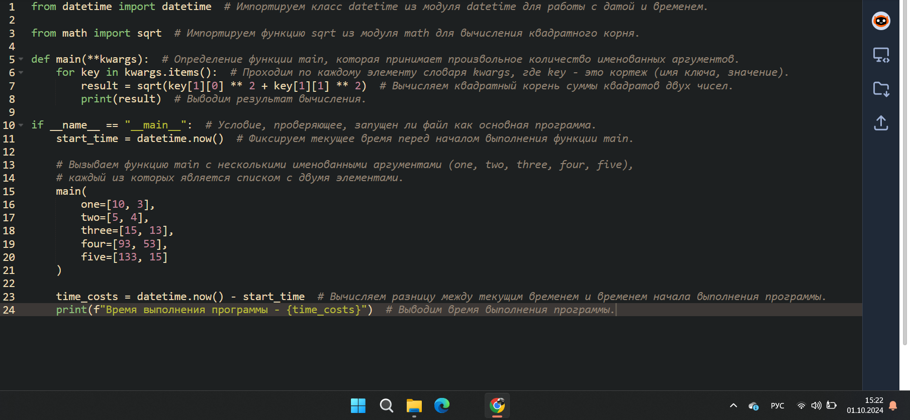

## Выводы
Вычисляет и выводит расстояние (евклидово расстояние) между двумя точками, заданными списками чисел (x, y), для каждого переданного аргумента. В конце выводится время выполнения программы.
  
## Самостоятельная работа №2
### Напишите программу, которая будет заменять игральную кость с 6 гранями. Если значение равно 5 или 6, то в консоль выводится «Вы победили», если значения 3 или 4, то вы рекурсивно должны вызвать эту же функцию, если значение 1 или 2, то в консоль выводится «Вы проиграли». При этом каждый вызов функции необходимо выводить в консоль значение “кубика”. Для выполнения задания необходимо использовать стандартную библиотеку random. Программу нужно написать, используя одну функцию и “точку входа” 

```python
import random

def roll_dice():
    dice = random.randint(1, 6) 
    print(f"Кубик показывает: {dice}") 

    if dice in [5, 6]:
        print("Вы победили")
    elif dice in [3, 4]:
        roll_dice()
    else:
        print("Вы проиграли")

if __name__ == "__main__":
    roll_dice()

```
### Результат.
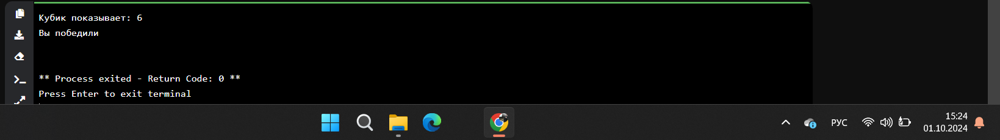

## Выводы
Симулирует бросок кубика. Если выпадает 5 или 6 — пользователь побеждает, если 3 или 4 — бросок повторяется, если 1 или 2 — проигрыш.
  
## Самостоятельная работа №3
### Напишите программу, которая будет выводить текущее время, с точностью до секунд на протяжении 5 секунд. Программу нужно написать с использованием цикла. Подсказка: необходимо использовать модуль datetime и time, а также вам необходимо как-то “усыплять” программу на 1 секунду.

```python
from datetime import datetime 
import time 

def print_time(): 
    for _ in range(5): 
        now = datetime.now().strftime("%H:%M:%S") 
        print(f"Текущее время: {now}") 
        time.sleep(1)

if __name__ == "__main__":
    print_time()

```
### Результат.
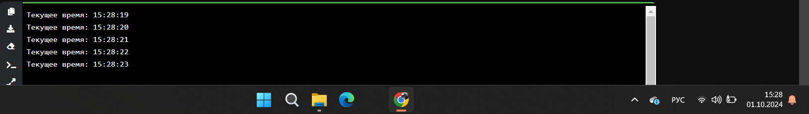

## Выводы
Выводит текущее время в формате часов, минут и секунд с паузой в 1 секунду между каждым выводом, повторяя это 5 раз.
  
## Самостоятельная работа №4
### Напишите программу, которая считает среднее арифметическое от аргументов вызываемое функции, с условием того, что изначальное количество этих аргументов неизвестно. Программу необходимо реализовать используя одну функцию и “точку входа”. 
```python
def average(*args):
    if len(args) == 0:
        return 0 
    return sum(args) / len(args)

if __name__ == "__main__":
    print(average(1, 2, 3, 4, 5)) 
    print(average(10, 20, 30))

```
### Результат.
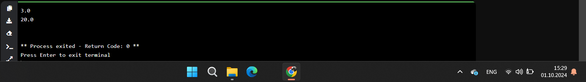

## Выводы
Вычисляет среднее значение для переданных чисел. Если аргументы отсутствуют, возвращает 0.
  
## Самостоятельная работа №5
### Создайте два Python файла, в одном будет выполняться вычисление площади треугольника при помощи формулы Герона (необходимо реализовать через функцию), а во втором будет происходить взаимодействие с пользователем (получение всей необходимой информации и вывод результатов). Напишите эту программу и выведите в консоль полученную площадь. 

## Файл 1: Main.py
```python
from heron_formula import triangle_area

if __name__ == "__main__":
    a = float(input("Введите длину первой стороны треугольника: "))
    b = float(input("Введите длину второй стороны треугольника: "))
    c = float(input("Введите длину третьей стороны треугольника: "))
    
    area = triangle_area(a, b, c) 
    print(f"Площадь треугольника: {area}")
```
## Файл 2: Heron_formula.py
```python
import math

def triangle_area(a, b, c):
    s = (a + b + c) / 2
    return math.sqrt(s * (s - a) * (s - b) * (s - c))
```

### Результат.
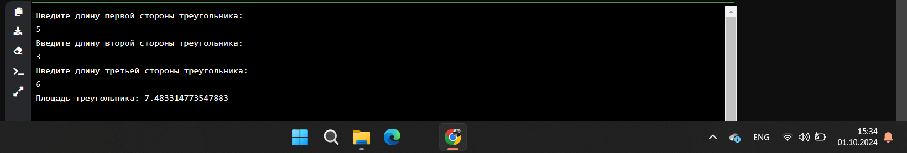

## Выводы
Запрашивает длины сторон треугольника и вычисляет его площадь по формуле Герона.

## Общие выводы по теме
Тема 4. Функции и стандартные модули/библиотеки охватывают широкий спектр возможностей Python, от базовых вычислений и работы с аргументами до более сложных задач, таких как работа с датами и временем, использование случайных чисел и реализация алгоритмов.
