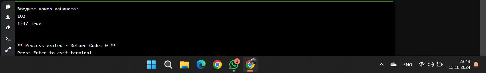
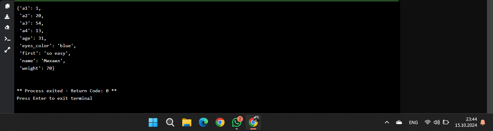
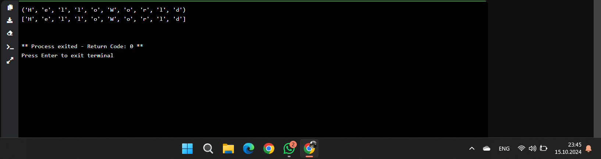
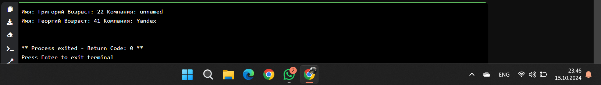
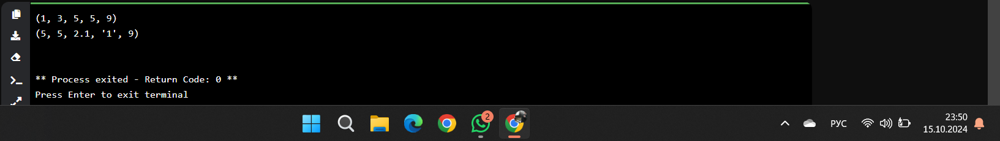
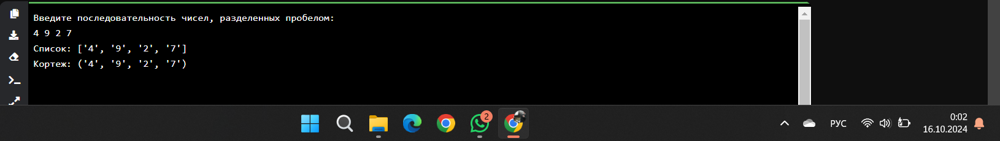
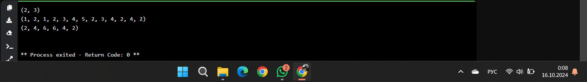
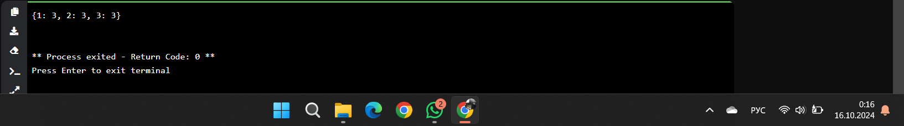
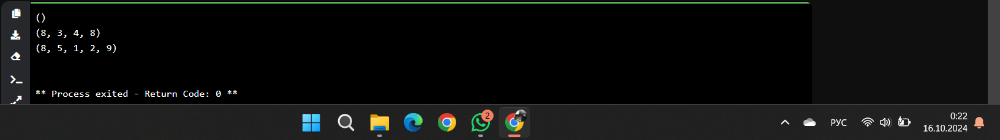
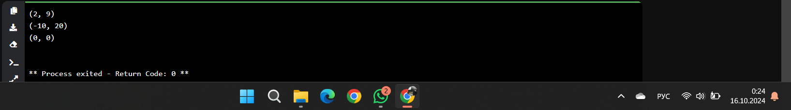

# Тема 6. Базовые коллекции: словари, кортежи
Отчет по Теме #6 выполнил(а):
- Ахметшин Данил Эдуардович
- ИВТ-22-1

| Задание | Лаб_раб | Сам_раб |
| ------ | ------ | ------ |
| Задание 1 | + | + |
| Задание 2 | + | + |
| Задание 3 | + | + |
| Задание 4 | + | + |
| Задание 5 | + | + |
| Задание 6 | - | - |
| Задание 7 | - | - |
| Задание 8 | - | - |
| Задание 9 | - | - |
| Задание 10 | - | - |

знак "+" - задание выполнено; знак "-" - задание не выполнено;

Работу проверили:
- к.э.н., доцент Панов М.А.

## Лабораторная работа №1
### В школе, где вы учились, узнали, что вы крутой программист и попросили написать программу для учителей, которая будет при вводе кабинета писать для него ключ доступа и статус, занят кабинет или нет. При написании программы необходимо использовать словарь (dict), который на вход получает номер кабинета, а выводит необходимую информацию. Если кабинета, который вы ввели нет в словаре, то в консоль в виде значения ключа нужно вывести "None" и виде статуса вывести "False". По большому счету написав данную программу мы с вами научились заменять иногда громоздкую конструкцию if/elif/else. Поскольку здесь функционал словаря полностью повторяет функционал условия, но при этом у использования словарей в более сложных программах есть намного больше возможностей реализации.

```python
request = int(input('Введите номер кабинета: '))
dictionary = {
    101: {'key': 1234, 'access':True},
    102: {'key': 1337, 'access': True},
    103: {'key': 8943, 'access': True}, 
    104: {'key': 5555, 'access': False}, 
    None: {'key': None, 'access': False},
    }
response = dictionary.get(request) 
if not response:
    response = dictionary[None]
key = response.get('key')
access = response.get('access')
print(key, access)
```
### Результат.


## Выводы
Операция set_1 - set_2 возвращает разность множеств, то есть элементы, которые есть в set_1, но отсутствуют в set_2.

## Лабораторная работа №2
### Алексей решил создать самый большой словарь в мире. Для этого он придумал функцию dict maker (**kwargs), которая принимает неограниченное количество параметров «ключ: значение» и обновляет созданный им словарь my dict, состоящий всего из одного элемента «first» со значением «so easy». Помогите Алексею создать данную функцию. Ниже на скриншоте мы использовали встроенный модуль pprint, который выводит большие объемы информации более понятно для восприятия человеческим глазом. Иногда очень удобно использовать данную возможность Python.
```python
from pprint import pprint
my_dict = {'first': 'so easy'}

def dict_maker(**kwargs):
    my_dict.update(**kwargs)
dict_maker(a1=1, a2=20, a3=54, a4=13)
dict_maker(name='Михаил', age=31, weight=70, eyes_color='blue') 
pprint(my_dict)
```
### Результат.


## Выводы
При set() cначала создается множество из символов строки 'abcdefg'. Затем в это множество добавляются элементы от 1 до 4. Множество frozenset неизменяемо, поэтому при попытке использовать метод add() возникнет ошибка AttributeError, так как у объектов типа frozenset нет метода add().

## Лабораторная работа №3
### Для решения некоторых задач бывает необходимо разложить строку на отдельные символы. Мы знаем что это можно сделать при помощи split(), у которого более гибкая настройка для разделения для этого, но если нам нужно посимвольно разделить строку без всяких условий, то для этого мы можем использовать кортежи (tuple). Для этого напишем любую строку, которую будем делить и "обвернем" ее в tuple и дальше мы можем как нам угодно с ней работать, например, сделать ее списком (тогда получится полный аналог split()) или же работать с ним дальше, как с кортежем.
```python
input_string = "HelloWorld"
result = tuple(input_string)
print(result)
print(list(result))
```
### Результат.


## Выводы
Функция меняет местами первый и последний элементы списка. В примере список [1, 2, 3, 4, 5] преобразуется в [5, 2, 3, 4, 1].
  
## Лабораторная работа №4
### Вовочка решил написать крутую функцию, которая будет писать имя, возраст и место работы, но при этом на вход этой функции будет поступать кортеж. Помогите Вовочке написать эту программу.

```python
def personal_info(name, age, company='unnamed'):
    print(f"Имя: {name} Возраст: {age} Компания: {company}")
tom = ("Григорий", 22)
personal_info(*tom)
bob = ("Георгий", 41, "Yandex")
personal_info(*bob)
```
### Результат.


## Выводы
Срез списка возвращает элементы с индексами 2, 3, 4 и 5

## Лабораторная работа №5
### Для сопровождения первых лиц государства Х нужен кортеж, но никто не может определиться с порядком машин, поэтому вам нужно написать функцию, которая будет сортировать кортеж, состоящий из целых чисел по возрастанию, и возвращает его. Если хотя бы один элемент не является целым числом, то функция возвращает исходный
кортеж.

```python
def tuple_sort(tpl):
    for elm in tpl:
        if not isinstance(elm, int): 
            return tpl
    return tuple(sorted(tpl))
if __name__ == '__main__':
    print(tuple_sort((5, 5, 3, 1, 9)))
    print(tuple_sort((5, 5, 2.1, '1', 9)))
```
### Результат.


## Выводы
Функция возвращает результат деления максимального элемента на длину списка:
- Для списка [3, 5, 7, 3, 33] результат будет 33 / 5 = 6.6.
- Для списка [-12.5, 54, 77.3, 0, -36, 98.2, -63, 21.7, 47, -89.6] результат будет 98.2 / 10 = 9.82.
- Для списка [-25.8, 86, 12.5, -56, 73.2, 0, 43, -91.5, 65.9, -7] результат будет 86 / 10 = 8.6.

## Самостоятельная работа №1
### При создании сайта у вас возникла потребность обрабатывать данные пользователя в странной форме, а потом переводить их в нужные вам форматы. Вы хотите принимать от пользователя последовательность чисел, разделенных пробелом, а после переформатировать эти данные в список и кортеж. Реализуйте вашу задумку. Для получения начальных данных используйте input(). Результатом программы будет выведенный список и кортеж из начальных данных.

```python
data = input("Введите последовательность чисел, разделенных пробелом: ")
data_list = data.split()
data_tuple = tuple(data_list)
print("Список:", data_list)
print("Кортеж:", data_tuple)
```
### Результат.


## Выводы
В данной программе мы работаем с набором чеков, выданных в ресторане. Мы определили:
- Общее количество выданных чеков, подсчитав количество элементов в списке.
- Количество уникальных посетителей, создав множество (где элементы не повторяются).
- Самого частого посетителя, используя функцию Counter, чтобы определить, какой код работника встречался чаще всего.
  
## Самостоятельная работа №2
### Николай знает, что кортежи являются неизменяемыми, но он очень упрямый и всегда хочет доказать, что он прав. Студент решил создать функцию, которая будет удалять первое появление определенного элемента из кортежа по значению и возвращать кортеж без него. Попробуйте повторить шедевр не признающего авторитеты начинающего программиста. Но учтите, что Николай не всегда уверен в наличии элемента в кортеже (в этом случае кортеж вернется функцией в исходном виде).
### Входные данные:
### (1, 2, 3), 1)
### (1, 2, 3, 1, 2, 3, 4, 5, 2, 3, 4, 2, 4, 2), 3)
### (2, 4, 6, 6, 4, 2), 9)
### Ожидаемый результат:
### (2, 3)
### (1, 2, 1, 2, 3, 4, 5, 2, 3, 4, 2, 4, 2)
### (2, 4, 6, 6, 4, 2)

```python
def remove_element_from_tuple(tpl, element):
    if element in tpl:
        tpl_list = list(tpl)
        tpl_list.remove(element)
        return tuple(tpl_list)
    return tpl

print(remove_element_from_tuple((1, 2, 3), 1))
print(remove_element_from_tuple((1, 2, 3, 1, 2, 3, 4, 5, 2, 3, 4, 2, 4, 2), 3))
print(remove_element_from_tuple((2, 4, 6, 6, 4, 2), 9))

```
### Результат.


## Выводы
В этой задаче мы анализировали результаты студентов по бегу:
- Нашли три лучших результата, отсортировав список и взяв первые три значения.
- Определили три худших результата, взяв последние три значения отсортированного списка.
- Собрали все результаты, которые больше или равны 10, чтобы показать только значимые результаты.
  
## Самостоятельная работа №3
### Ребята поспорили кто из них одним нажатием на numpad наберет больше повторяющихся цифр, но не понимают, как узнать победителя. Вам им нужно в этом помочь. Дана строка в виде случайной последовательности чисел от 0 до 9 (длина строки минимум 15 символов). Требуется создать словарь, который в качестве ключей будет принимать данные числа (т. е. ключи будут типом int), а в качестве значений - количество этих чисел в имеющейся последовательности. Для построения словаря создайте функцию, принимающую строку из цифр. Функция должна возвратить словарь из 3-х самых часто встречаемых чисел, также эти значения нужно вывести в порядке возрастания ключа.

```python
from collections import Counter

def count_digits(s):
    digit_counts = Counter(map(int, s))
    most_common = digit_counts.most_common(3)
    result = {key: value for key, value in sorted(most_common)}
    return result
print(count_digits("123456789012345678901234567890")) 


```
### Результат.


## Выводы
В задаче мы искали площади треугольников, используя формулу Герона. Были выбраны:
- Максимальные элементы из трёх списков для построения первого треугольника.
- Минимальные элементы для второго треугольника. Мы вычислили их площади с помощью формулы Герона.
  
## Самостоятельная работа №4
### Ваш хороший друг владеет офисом со входом по электронным картам, ему нужно чтобы вы написали программу, которая показывала в каком порядке сотрудники входили и выходили из офиса. Определение сотрудника происходит по id. Напишите функцию, которая на вход принимает кортеж и случайный элемент (id), его можно придумать самостоятельно. Требуется вернуть новый кортеж, начинающийся с первого появления элемента в нем и заканчивающийся вторым его появлением включительно.
### Если элемента нет вовсе - вернуть пустой кортеж.
### Если элемент встречается только один раз, то вернуть кортеж, который начинается с него и идет до конца исходного.
### Входные данные:
### (1, 2, 3), 8)
### (1, 8, 3, 4, 8, 8, 9, 2), 8) (1, 2, 8, 5, 1, 2, 9), 8)
### Ожидаемый результат:
### ()
### (8, 3, 4, 8)
### (8, 5, 1, 2, 9)
```python
def get_sequence(tpl, element):
    if tpl.count(element) == 0:
        return ()
    first_idx = tpl.index(element)
    if tpl.count(element) > 1:
        second_idx = tpl.index(element, first_idx + 1)
        return tpl[first_idx:second_idx + 1]
    return tpl[first_idx:]

print(get_sequence((1, 2, 3), 8))
print(get_sequence((1, 8, 3, 4, 8, 8, 9, 2), 8))
print(get_sequence((1, 2, 8, 5, 1, 2, 9), 8))

```
### Результат.


## Выводы
В этой программе мы корректировали оценки студентов:
- Все двойки были удалены.
- Все тройки были заменены на четверки. Программа проходила через три набора оценок и исправляла их.
  
## Самостоятельная работа №5
### Самостоятельно придумайте и решите задачу, в которой будут обязательно использоваться кортеж или список. Проведите минимум три теста для проверки работоспособности вашей задачи.

```python
def min_max(lst):
    return min(lst), max(lst)

print(min_max([3, 5, 7, 2, 9]))
print(min_max([-10, 20, 5, -3]))
print(min_max([0, 0, 0]))

```

### Результат.


## Выводы
Мы работали с преобразованием чисел в строки при их многократном повторении:
- Если число повторяется, то в множество добавляется не только само число, но и его строковые дубликаты с количеством повторений.
- Например, число 4, встречающееся три раза, было преобразовано в множества "4", "44", "444".

## Общие выводы по теме
В данной теме были изучены базовые коллекции Python, такие как множества, списки и их возможности. Рассмотрены операции над коллекциями, включая добавление, удаление, срезы и работу с уникальными элементами. Задания помогли закрепить навыки использования этих коллекций для решения практических задач.
