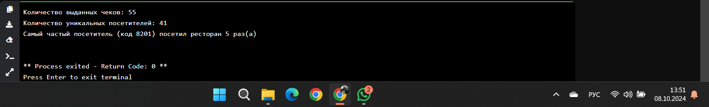
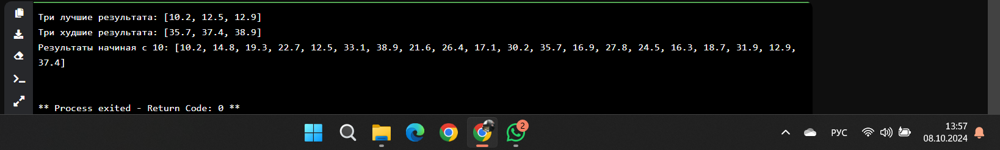
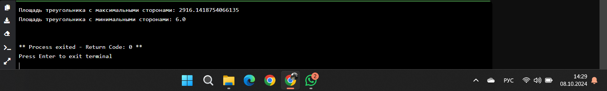
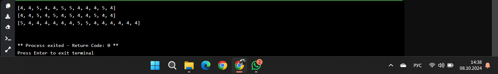
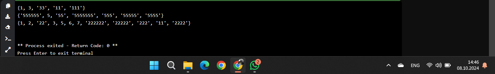

# Тема 7. Работа с файлами (ввод, вывод)
Отчет по Теме #7 выполнил(а):
- Ахметшин Данил Эдуардович
- ИВТ-22-1

| Задание | Лаб_раб | Сам_раб |
| ------ | ------ | ------ |
| Задание 1 | + | + |
| Задание 2 | + | + |
| Задание 3 | + | + |
| Задание 4 | + | + |
| Задание 5 | + | + |
| Задание 6 | + | - |
| Задание 7 | + | - |
| Задание 8 | + | - |
| Задание 9 | + | - |
| Задание 10 | + | - |

знак "+" - задание выполнено; знак "-" - задание не выполнено;

Работу проверили:
- к.э.н., доцент Панов М.А.

## Лабораторная работа №1
### Составьте текстовый файл и положите его в одну директорию с программой на Python. Текстовый файл должен состоять минимум из двух строк.

### Результат.


## Выводы
Операция set_1 - set_2 возвращает разность множеств, то есть элементы, которые есть в set_1, но отсутствуют в set_2.

## Лабораторная работа №2
### Напишите программу, которая выведет только первую строку из вашего файла, при этом используйте конструкцию open()/close().

```python
f = open('input.txt', 'r')
print(f.readline())
f.close()
```
### Результат.
.png)

## Выводы
При set() cначала создается множество из символов строки 'abcdefg'. Затем в это множество добавляются элементы от 1 до 4. Множество frozenset неизменяемо, поэтому при попытке использовать метод add() возникнет ошибка AttributeError, так как у объектов типа frozenset нет метода add().

## Лабораторная работа №3
### Напишите программу, которая выведет все строки из вашего файла в массиве, при этом используйте конструкцию open()/close().
```python
f = open('input.txt', 'r') 
print(f.readlines())
f. close()
```
### Результат.


## Выводы
Функция меняет местами первый и последний элементы списка. В примере список [1, 2, 3, 4, 5] преобразуется в [5, 2, 3, 4, 1].
  
## Лабораторная работа №4
### Напишите программу, которая выведет все строки из вашего файла массиве, при этом используйте конструкцию with open().

```python
with open('input.txt') as f: 
    print(f.readlines())
```
### Результат.


## Выводы
Срез списка возвращает элементы с индексами 2, 3, 4 и 5

## Лабораторная работа №5
### Напишите программу, которая выведет каждую строку из вашего файла отдельно, при этом используйте конструкцию with open().
```python
with open('input.txt') as f:
    for line in f: 
        print(line)
```
### Результат.


## Выводы
Функция возвращает результат деления максимального элемента на длину списка:
- Для списка [3, 5, 7, 3, 33] результат будет 33 / 5 = 6.6.
- Для списка [-12.5, 54, 77.3, 0, -36, 98.2, -63, 21.7, 47, -89.6] результат будет 98.2 / 10 = 9.82.
- Для списка [-25.8, 86, 12.5, -56, 73.2, 0, 43, -91.5, 65.9, -7] результат будет 86 / 10 = 8.6.

## Лабораторная работа №6
### Напишите программу, которая будет добавлять новую строку в ваш файл, а потом выведет полученный файл в консоль. Вывод можно осуществлять любым способом. Обязательно проверьте сам файл, чтобы изменения в нем тоже отображались.
```python
with open('input.txt', 'a+') as f:
    f.write("\nIm additional line")
    
with open('input.txt', 'r') as f:
    result = f.readlines()
    print(result)
```
### Результат.


## Выводы
Список супергероев распаковывается в три переменные.

## Лабораторная работа №7
### Напишите программу, которая перепишет всю информацию, которая была у вас в файле до этого, например напишет любые данные из произвольно вами составленного списка. Также не забудьте проверить что измененная вами информация сохранилась в файле.

```python
lines = ['one', 'two', 'three'] 
with open('input.txt', 'w') as f:
    for line in lines:
        f.write('\nCycle run ' + line)
    print('Done!')
```
### Результат.


## Выводы
После сортировки список выглядит так: [-91.5, -56, -25.8, -7, 0, 12.5, 43, 65.9, 73.2, 86]. После удаления минимального элемента результат будет: [-56, -25.8, -7, 0, 12.5, 43, 65.9, 73.2, 86].

## Лабораторная работа №8
### Выберите любую папку на своем компьютере, имеющую вложенные директории. Выведите на печать в терминал ее содержимое, как и всех подкаталогов при помощи функции print docs(directory). 

```python
import os

def print_docs(directory):
    all_files = os.walk(directory)
    for catalog in all_files:
        print(f'Папка {catalog[0]} содержит:')
        print(f'Директории: {", ".join([folder for folder in catalog[1]])}')
        print(f'Файлы: {", ".join([file for file in catalog[2]])}')
        print('-' * 40)

print_docs(r'C:\Users\akhme\OneDrive\Документы\Downloads')
```
### Результат.


## Выводы
Функция list_maker создает список, состоящий из одинаковых случайных чисел. Количество элементов в списке также случайное. В результате программа выводит список списков случайной длины и с одинаковыми значениями.

## Лабораторная работа №9
### Документ «input.txt» содержит следующий текст:
### Приветствие
### Спасибо
### Извините
### Пожалуйста
### Панов
### До свидания
### Ты готов?
### Как дела?
### С днем рождения!
### Удача!
### Я тебя люблю.
### Требуется реализовать функцию, которая выводит слово, имеющее максимальную длину (или список слов, если таковых несколько). Проверьте работоспособность программы на своем наборе данных

```python
def longest_words (file):
    with open(file, encoding='utf-8') as f:
        words = f.read().split()
        max_length = len(max(words, key=len))
        for word in words:
            if len(word) == max_length:
                sought_words = word
        if len(sought_words) == 1:
            return sought_words[8] 
        return sought_words
    
print(longest_words('input.txt'))
```
### Результат.


## Выводы
Функция проверяет, является ли одно множество супермножеством другого, выводит результаты для разных пар множеств.

## Лабораторная работа №10
### Требуется создать csv-файл «rows 300.csv» со следующими столбцами:
### • № - номер по порядку (от 1 до 300);
### • Секунда - текущая секунда на вашем ПК;
### • Микросекунда - текущая миллисекунда на часах.
### Для наглядности на каждой итерации цикла искусственно приостанавливайте скрипт на 0,01 секунды.

```python
import csv
import datetime
import time
with open('rows_300.csv','w', encoding='utf-8', newline='') as f: 
    writer = csv.writer(f) 
    writer.writerow(['№', 'Секунда ', 'Микросекунда']) 
    for line in range(1, 301):
        writer.writerow([line, datetime.datetime.now().second, datetime.datetime.now().microsecond])
        time.sleep(0.01)
```
### Результат.


## Выводы
Оператор среза [::-1] переворачивает список.

## Самостоятельная работа №1
### Найдите в интернете любую статью (объем статьи не менее 200 слов), скопируйте ее содержимое в файл и напишите программу, которая считает количество слов в текстовом файле и определит самое часто встречающееся слово. Результатом выполнения задачи будет: скриншот файла со статьей, листинг кода, и вывод в консоль, в котором будет указана вся необходимая информация.

```python
from collections import Counter
with open('article.txt', 'r', encoding='utf-8') as file:
    text = file.read()
words = text.split()
word_counts = Counter(word.lower() for word in words)
most_common_word, most_common_count = word_counts.most_common(1)[0]
print(f"Количество слов в файле: {len(words)}")
print(f"Самое частое слово: '{most_common_word}', встречается {most_common_count} раз.")
```
### Результат.


## Выводы
В данной программе мы работаем с набором чеков, выданных в ресторане. Мы определили:
- Общее количество выданных чеков, подсчитав количество элементов в списке.
- Количество уникальных посетителей, создав множество (где элементы не повторяются).
- Самого частого посетителя, используя функцию Counter, чтобы определить, какой код работника встречался чаще всего.
  
## Самостоятельная работа №2
### У вас появилась потребность в ведении книги расходов, посмотрев все существующие варианты вы пришли к выводу что вас ничего не устраивает и нужно все делать самому. Напишите программу для учета расходов. Программа должна позволять вводить информацию о расходах, сохранять ее в файл и выводить существующие данные в консоль. Ввод информации происходит через консоль. Результатом выполнения задачи будет: скриншот файла с учетом расходов, листинг кода, и вывод в консоль, с демонстрацией работоспособности программы.

```python
import os
filename = 'expenses.txt'
def add_expense(amount, description):
    with open(filename, 'a', encoding='utf-8') as file:
        file.write(f"{amount}, {description}\n")
def show_expenses():
    if os.path.exists(filename):
        with open(filename, 'r', encoding='utf-8') as file:
            expenses = file.readlines()
            if expenses:
                print("Ваши расходы:")
                for expense in expenses:
                    print(expense.strip())
            else:
                print("Нет записей расходов.")
    else:
        print("Файл с расходами не найден.")
while True:
    print("\n1. Добавить расход")
    print("2. Показать все расходы")
    print("3. Выйти")

    choice = input("Выберите действие: ")

    if choice == '1':
        amount = input("Введите сумму расхода: ")
        description = input("Введите описание расхода: ")
        add_expense(amount, description)
        print("Расход добавлен!")
    elif choice == '2':
        show_expenses()
    elif choice == '3':
        break
    else:
        print("Неверный выбор, попробуйте снова.")
```
### Результат.


## Выводы
В этой задаче мы анализировали результаты студентов по бегу:
- Нашли три лучших результата, отсортировав список и взяв первые три значения.
- Определили три худших результата, взяв последние три значения отсортированного списка.
- Собрали все результаты, которые больше или равны 10, чтобы показать только значимые результаты.
  
## Самостоятельная работа №3
### Имеется файл input.txt с текстом на латинице. Напишите программу, которая выводит следующую статистику по тексту: количество букв латинского алфавита; число слов; число строк.
### Текст в файле:
### Beautiful is better than ugly.
### Explicit is better than implicit.
### Simple is better than complex.
### Complex is better than complicated.
### Ожидаемый результат:
### Input file contains:
### 108 letters
### 20 words
### 4 lines

```python
with open('input.txt', 'r') as file:
    text = file.read()
lines = text.splitlines()
line_count = len(lines)
word_count = len(text.split())
letter_count = sum(char.isalpha() for char in text)
print(f"Input file contains:")
print(f"{letter_count} letters")
print(f"{word_count} words")
print(f"{line_count} lines")
```
### Результат.


## Выводы
В задаче мы искали площади треугольников, используя формулу Герона. Были выбраны:
- Максимальные элементы из трёх списков для построения первого треугольника.
- Минимальные элементы для второго треугольника. Мы вычислили их площади с помощью формулы Герона.
  
## Самостоятельная работа №4
### Напишите программу, которая получает на вход предложение, выводит его в терминал, заменяя все запрещенные слова звездочками * (количество звездочек равно количеству букв в слове). Запрещенные слова, разделенные символом пробела, хранятся в текстовом файле input.txt. Все слова в этом файле записаны в нижнем регистре. Программа должна заменить запрещенные слова, где бы они ни встречались, даже в середине другого слова. Замена производится независимо от регистра: если
### файл input.txt содержит запрещенное слово exam, то слова exam, Exam, ExaM, EXAM и exAm должны быть заменены на ****
### • Запрещенные слова:
### hello email python the exam wor is
### Предложение для проверки:
### Hello, world! Python IS the programming language of thE future. My EMAIL is…
### PYTHON is awesome!!!!
### Ожидаемый результат:
### ***** ***1d! ****** ** *** programming language of*** future. My
### ***** **
### ****** ** awesome!!!!
```python
import re
with open('input.txt', 'r') as file:
    forbidden_words = file.read().split()
sentence = input("Введите предложение: ")
for word in forbidden_words:
    sentence = re.sub(word, '*' * len(word), sentence, flags=re.IGNORECASE)
print(sentence)
```
### Результат.


## Выводы
В этой программе мы корректировали оценки студентов:
- Все двойки были удалены.
- Все тройки были заменены на четверки. Программа проходила через три набора оценок и исправляла их.
  
## Самостоятельная работа №5
### Самостоятельно придумайте и решите задачу, которая будет взаимодействовать с текстовым файлом.

```python
filename = 'notes.txt'
def add_note(note):
    with open(filename, 'a', encoding='utf-8') as file:
        file.write(note + '\n')
def show_notes():
    if os.path.exists(filename):
        with open(filename, 'r', encoding='utf-8') as file:
            notes = file.readlines()
            if notes:
                print("Ваши заметки:")
                for note in notes:
                    print(note.strip())
            else:
                print("Нет записей заметок.")
    else:
        print("Файл с заметками не найден.")
while True:
    print("\n1. Добавить заметку")
    print("2. Показать все заметки")
    print("3. Выйти")

    choice = input("Выберите действие: ")

    if choice == '1':
        note = input("Введите заметку: ")
        add_note(note)
        print("Заметка добавлена!")
    elif choice == '2':
        show_notes()
    elif choice == '3':
        break
    else:
        print("Неверный выбор, попробуйте снова.")
```

### Результат.


## Выводы
Мы работали с преобразованием чисел в строки при их многократном повторении:
- Если число повторяется, то в множество добавляется не только само число, но и его строковые дубликаты с количеством повторений.
- Например, число 4, встречающееся три раза, было преобразовано в множества "4", "44", "444".

## Общие выводы по теме
В данной теме были изучены базовые коллекции Python, такие как множества, списки и их возможности. Рассмотрены операции над коллекциями, включая добавление, удаление, срезы и работу с уникальными элементами. Задания помогли закрепить навыки использования этих коллекций для решения практических задач.
