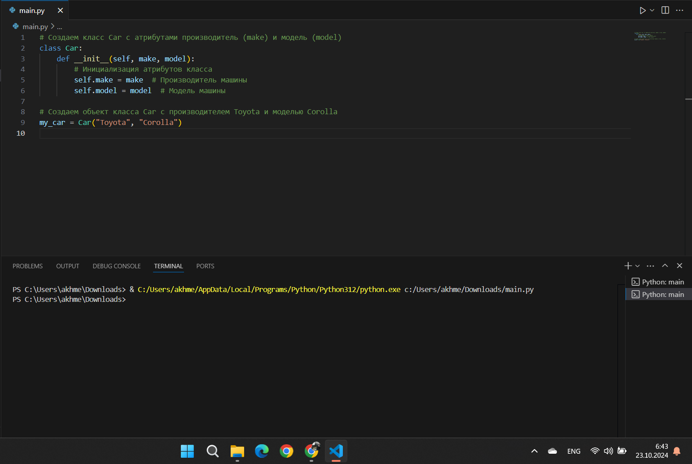
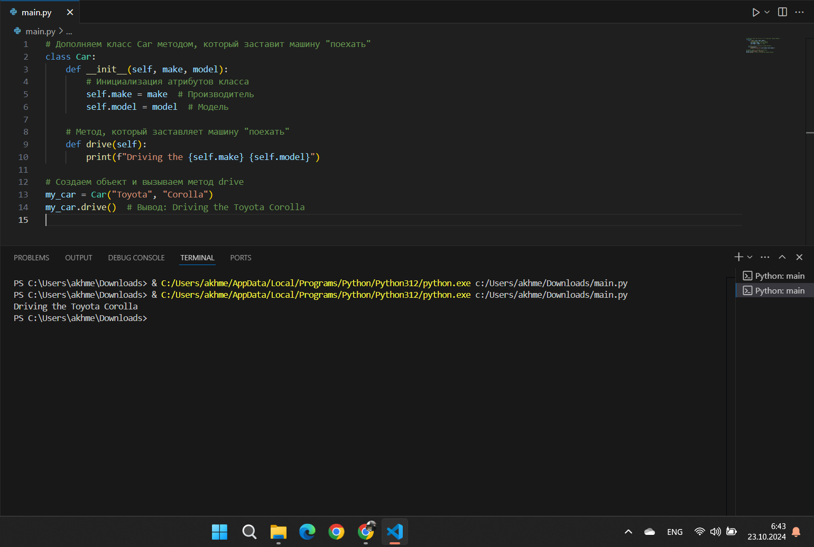
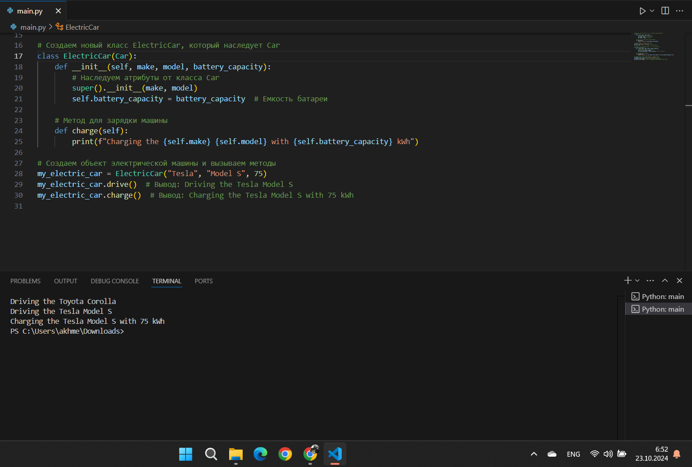
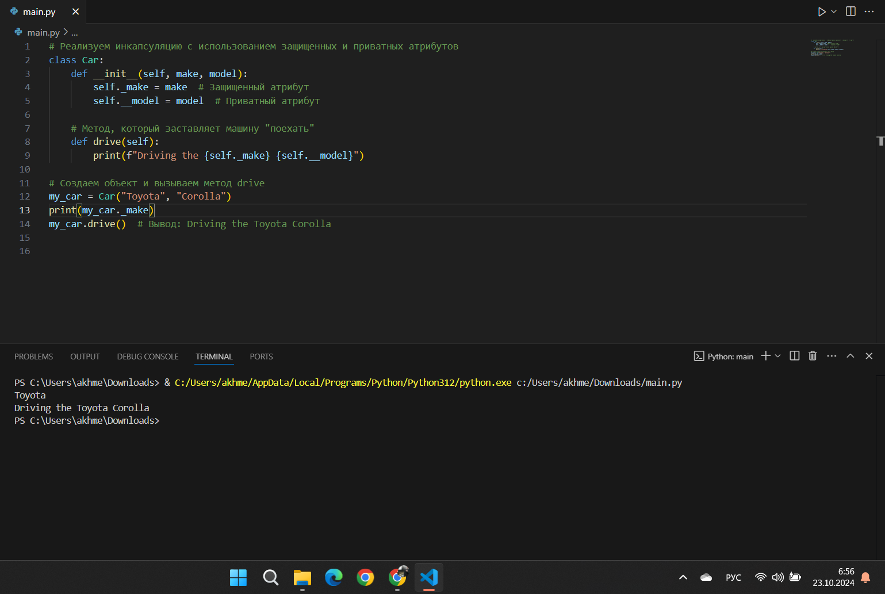
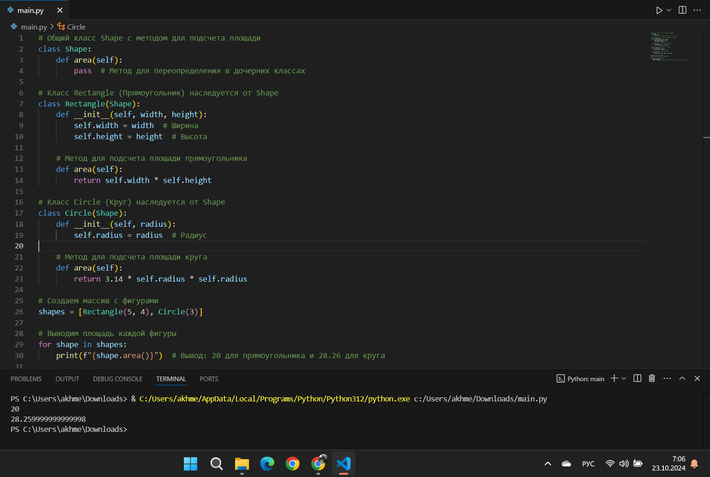
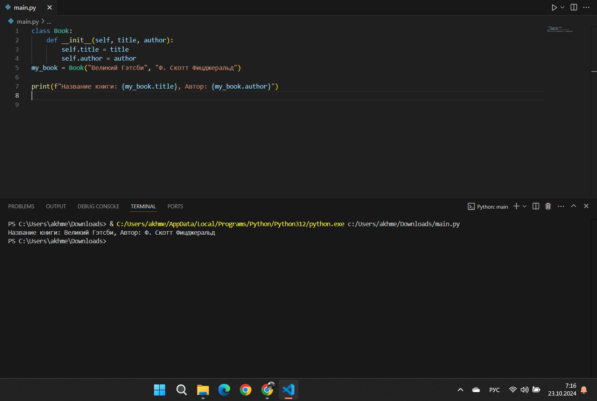
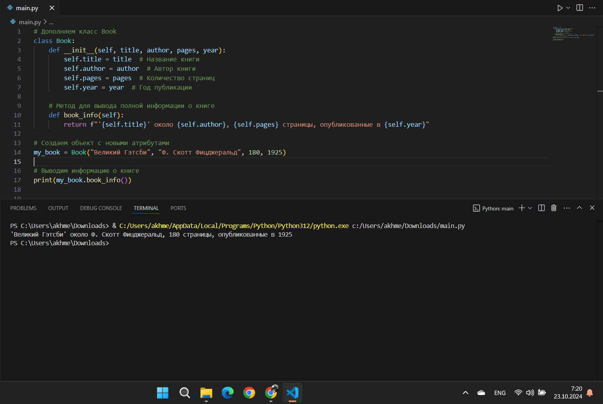
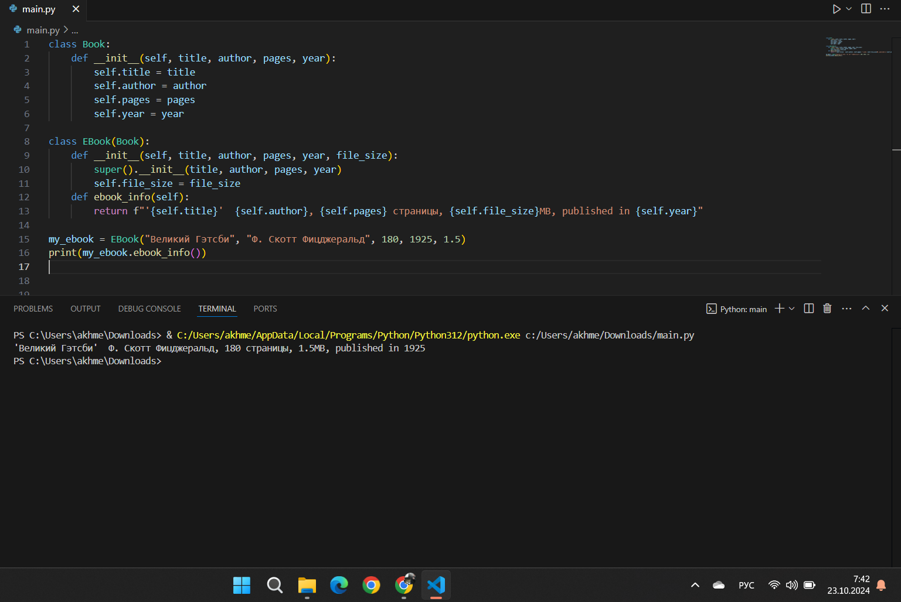
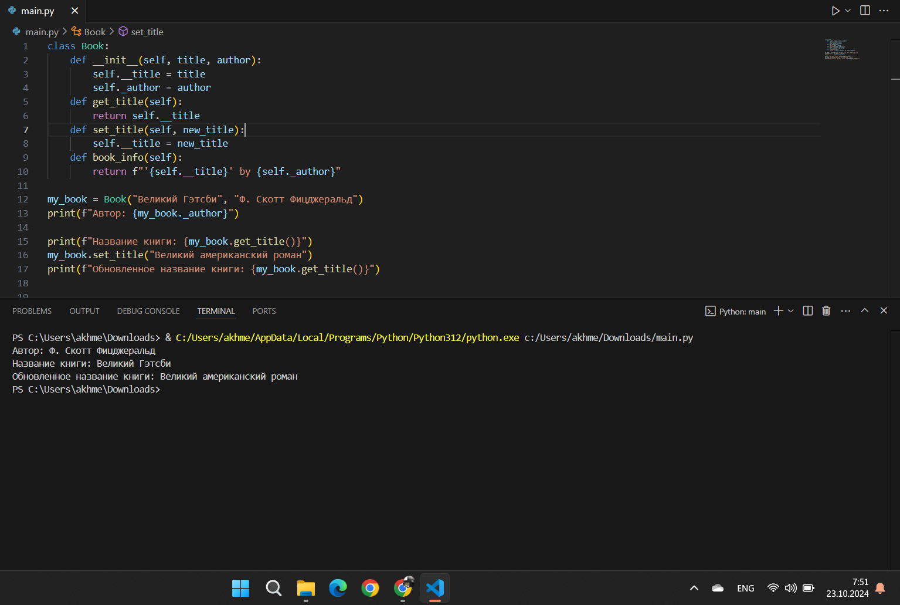
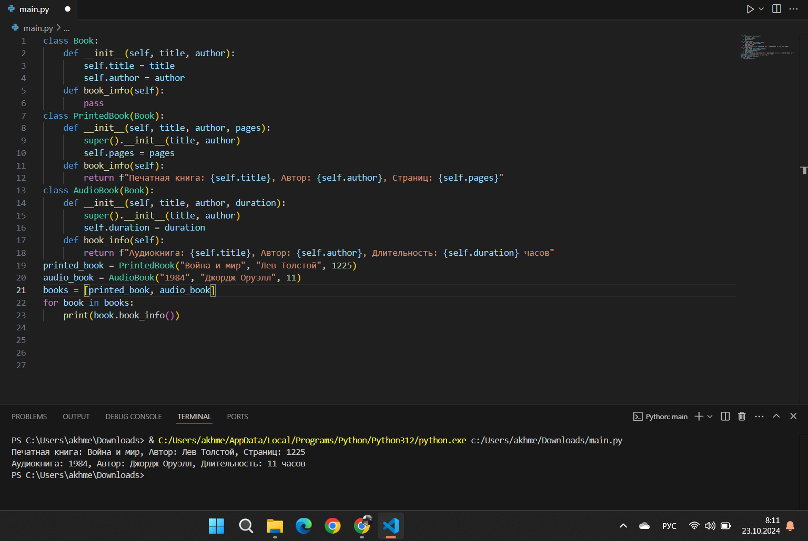

# Тема 8. Основы объектно-ориентированного программирования
Отчет по Теме #8 выполнил(а):
- Ахметшин Данил Эдуардович
- ИВТ-22-1

| Задание | Лаб_раб | Сам_раб |
| ------ | ------ | ------ |
| Задание 1 | + | + |
| Задание 2 | + | + |
| Задание 3 | + | + |
| Задание 4 | + | + |
| Задание 5 | + | + |
| Задание 6 | - | - |
| Задание 7 | - | - |
| Задание 8 | - | - |
| Задание 9 | - | - |
| Задание 10 | - | - |

знак "+" - задание выполнено; знак "-" - задание не выполнено;

Работу проверили:
- к.э.н., доцент Панов М.А.

## Лабораторная работа №1
### Создайте класс "Car" с атрибутами производитель и модель. Создайте объект этого класса. Напишите комментарии для кода, объясняющие его работу. Результатом выполнения задания будет листинг кода с комментариями.

```python
# Создаем класс Car с атрибутами производитель (make) и модель (model)
class Car:
    def __init__(self, make, model):
        # Инициализация атрибутов класса
        self.make = make  # Производитель машины
        self.model = model  # Модель машины

# Создаем объект класса Car с производителем Toyota и моделью Corolla
my_car = Car("Toyota", "Corolla")
```
### Результат.


## Выводы
- Создан класс Car с двумя атрибутами: make (производитель) и model (модель).
- В конструкторе __init__ эти атрибуты инициализируются при создании объекта класса.

## Лабораторная работа №2
### Дополните код из первого задания, добавив в него атрибуты и методы класса, заставьте машину "поехать". Напишите комментарии для кода, объясняющие его работу. Результатом выполнения задания будет листинг кода с комментариями и получившийся вывод в консоль.
```python
# Дополняем класс Car методом, который заставит машину "поехать"
class Car:
    def __init__(self, make, model):
        # Инициализация атрибутов класса
        self.make = make  # Производитель
        self.model = model  # Модель

    # Метод, который заставляет машину "поехать"
    def drive(self):
        print(f"Driving the {self.make} {self.model}")

# Создаем объект и вызываем метод drive
my_car = Car("Toyota", "Corolla")
my_car.drive()  # Вывод: Driving the Toyota Corolla
```
### Результат.


## Выводы
- К классу Car добавлен метод drive(), который выводит сообщение о том, что машина едет, используя атрибуты make и model.
- Теперь, вызвав метод drive(), мы получаем сообщение о вождении конкретной машины. В этом случае вывод: "Driving the Toyota Corolla".

## Лабораторная работа №3
### Создайте новый класс "ElectricCar" с методом "charge" и атрибутом емкость батареи. Реализуйте его наследование от класса, созданного в первом задании. Заставьте машину поехать, а потом заряжаться. Напишите комментарии для кода, объясняющие его работу. Результатом выполнения задания будет листинг кода с комментариями и получившийся вывод в консоль.
```python
# Создаем новый класс ElectricCar, который наследует Car
class ElectricCar(Car):
    def __init__(self, make, model, battery_capacity):
        # Наследуем атрибуты от класса Car
        super().__init__(make, model)
        self.battery_capacity = battery_capacity  # Емкость батареи

    # Метод для зарядки машины
    def charge(self):
        print(f"Charging the {self.make} {self.model} with {self.battery_capacity} kWh")

# Создаем объект электрической машины и вызываем методы
my_electric_car = ElectricCar("Tesla", "Model S", 75)
my_electric_car.drive()  # Вывод: Driving the Tesla Model S
my_electric_car.charge()  # Вывод: Charging the Tesla Model S with 75 kWh
```
### Результат.


## Выводы
- Класс ElectricCar наследуется от Car и добавляет новый атрибут battery_capacity для хранения емкости батареи.
- Добавлен метод charge(), который выводит сообщение о зарядке машины.
- При создании объекта my_electric_car с параметрами "Tesla", "Model S" и емкостью батареи 75 kWh можно вызвать как метод drive() (унаследованный от Car), так и метод charge().
  
## Лабораторная работа №4
### Реализуйте инкапсуляцию для класса, созданного в первом задании. Создайте защищенный атрибут производителя и приватный атрибут модели. Вызовите защищенный атрибут и заставьте машину поехать. Напишите комментарии для кода, объясняющие его работу. Результатом выполнения задания будет листинг кода с комментариями и получившийся вывод в консоль.

```python
# Реализуем инкапсуляцию с использованием защищенных и приватных атрибутов
class Car:
    def __init__(self, make, model):
        self._make = make  # Защищенный атрибут
        self.__model = model  # Приватный атрибут

    # Метод, который заставляет машину "поехать"
    def drive(self):
        print(f"Driving the {self._make} {self.__model}")

# Создаем объект и вызываем метод drive
my_car = Car("Toyota", "Corolla")
# print(my_car._make)
my_car.drive()  # Вывод: Driving the Toyota Corolla
```
### Результат.


## Выводы
- В классе Car используется инкапсуляция: атрибут make становится защищенным (_make), а атрибут model приватным (__model).
- Метод drive() имеет доступ к этим атрибутам и выводит сообщение о вождении.
- Пример: хотя атрибуты скрыты, метод drive() продолжает работать и выводит: "Driving the Toyota Corolla".

## Лабораторная работа №5
### Реализуйте полиморфизм создав основной (общий) класс "Shape", а также еще два класса "Rectangle" и "Circle". Внутри последних двух классов реализуйте методы для подсчета площади фигуры. После этого создайте массив с фигурами, поместите туда круг и прямоугольник, затем при помощи цикла выведите их площади. Напишите комментарии для кода, объясняющие его работу. Результатом выполнения задания будет листинг кода с комментариями и получившийся вывод в консоль.

```python
# Общий класс Shape с методом для подсчета площади
class Shape:
    def area(self):
        pass  # Метод для переопределения в дочерних классах

# Класс Rectangle (Прямоугольник) наследуется от Shape
class Rectangle(Shape):
    def __init__(self, width, height):
        self.width = width  # Ширина
        self.height = height  # Высота

    # Метод для подсчета площади прямоугольника
    def area(self):
        return self.width * self.height

# Класс Circle (Круг) наследуется от Shape
class Circle(Shape):
    def __init__(self, radius):
        self.radius = radius  # Радиус

    # Метод для подсчета площади круга
    def area(self):
        return 3.14 * self.radius * self.radius

# Создаем массив с фигурами
shapes = [Rectangle(5, 4), Circle(3)]

# Выводим площадь каждой фигуры
for shape in shapes:
    print(f"{shape.area()}")  # Вывод: 20 для прямоугольника и 28.26 для круга
```
### Результат.


## Выводы
- Создан базовый класс Shape с абстрактным методом area(), который должен быть переопределен в дочерних классах.
- Класс Rectangle переопределяет метод area(), чтобы вычислять площадь прямоугольника (ширина × высота).
- Класс Circle переопределяет метод area(), чтобы вычислять площадь круга (πr²).
- Массив shapes содержит объекты разных фигур, и вызов метода area() для каждой фигуры демонстрирует полиморфизм: одинаковый вызов метода для разных классов дает разные результаты.

## Самостоятельная работа №1
### Самостоятельно создайте класс и его объект. Они должны отличаться, от тех, что указаны в теоретическом материале (методичке) и лабораторных заданиях. Результатом выполнения задания будет листинг кода и получившийся вывод консоли.

```python
class Book:
    def __init__(self, title, author):
        self.title = title
        self.author = author
my_book = Book("Великий Гэтсби", "Ф. Скотт Фицджеральд")

print(f"Название книги: {my_book.title}, Автор: {my_book.author}")
```
### Результат.


## Выводы
- Создан класс Book с атрибутами title (название) и author (автор).
- Пример: объект my_book с названием "Великий Гэтсби" и автором "Ф. Скотт Фицджеральд". При выводе получается: "Название книги: Великий Гэтсби, Автор: Ф. Скотт Фицджеральд".
  
## Самостоятельная работа №2
### Самостоятельно создайте атрибуты и методы для ранее созданного класса. Они должны отличаться, от тех, что указаны в теоретическом материале (методичке) и лабораторных заданиях. Результатом выполнения задания будет листинг кода и получившийся вывод консоли.

```python
class Book:
    def __init__(self, title, author, pages, year):
        self.title = title
        self.author = author 
        self.pages = pages 
        self.year = year 
    def book_info(self):
        return f"'{self.title}' около {self.author}, {self.pages} страницы, опубликованные в {self.year}"
my_book = Book("Великий Гэтсби", "Ф. Скотт Фицджеральд", 180, 1925)
print(my_book.book_info())
```
### Результат.


## Выводы
- В класс Book добавлены атрибуты pages (количество страниц) и year (год публикации).
- Метод book_info() выводит подробную информацию о книге.
- Пример: "Великий Гэтсби" с 180 страницами, опубликованный в 1925 году. Вывод: "'Великий Гэтсби' около Ф. Скотт Фицджеральд, 180 страницы, опубликованные в 1925".
  
## Самостоятельная работа №3
### Самостоятельно реализуйте наследование, продолжая работать с ранее созданным классом. Оно должно отличаться, от того, что указано в теоретическом материале (методичке) и лабораторных заданиях. Результатом выполнения задания будет листинг кода и получившийся вывод консоли.

```python
class Book:
    def __init__(self, title, author, pages, year):
        self.title = title
        self.author = author 
        self.pages = pages 
        self.year = year 

class EBook(Book):
    def __init__(self, title, author, pages, year, file_size):
        super().__init__(title, author, pages, year)
        self.file_size = file_size 
    def ebook_info(self):
        return f"'{self.title}'  {self.author}, {self.pages} страницы, {self.file_size}MB, published in {self.year}"

my_ebook = EBook("Великий Гэтсби", "Ф. Скотт Фицджеральд", 180, 1925, 1.5)
print(my_ebook.ebook_info())  
```
### Результат.


## Выводы
- Создан класс EBook, который наследует класс Book и добавляет атрибут file_size (размер файла).
- Метод ebook_info() выводит информацию о книге вместе с размером файла.
- Пример: электронная версия книги "Великий Гэтсби" с размером файла 1.5MB. Вывод: "'Великий Гэтсби' Ф. Скотт Фицджеральд, 180 страницы, 1.5MB, published in 1925".
  
## Самостоятельная работа №4
### Самостоятельно реализуйте инкапсуляцию, продолжая работать с ранее созданным классом. Она должна отличаться, от того, что указана в теоретическом материале (методичке) и лабораторных заданиях. Результатом выполнения задания будет листинг кода и получившийся вывод консоли.
```python
class Book:
    def __init__(self, title, author):
        self.__title = title 
        self._author = author 
    def get_title(self):
        return self.__title
    def set_title(self, new_title):
        self.__title = new_title
    def book_info(self):
        return f"'{self.__title}' by {self._author}"

my_book = Book("Великий Гэтсби", "Ф. Скотт Фицджеральд")
print(f"Автор: {my_book._author}")

print(f"Название книги: {my_book.get_title()}")
my_book.set_title("Великий американский роман")
print(f"Обновленное название книги: {my_book.get_title()}")
```
### Результат.


## Выводы
- В классе Book атрибут title сделан приватным (__title), и добавлены методы для получения и изменения названия книги.
- Используется метод get_title() для доступа к приватному атрибуту и метод set_title() для изменения его значения.
- Пример: выводится старое название книги, затем оно изменяется на "Великий американский роман", после чего выводится новое название.
  
## Самостоятельная работа №5
### Самостоятельно реализуйте полиморфизм. Он должен отличаться, от того, что указан в теоретическом материале (методичке) и лабораторных заданиях. Результатом выполнения задания будет листинг кода и получившийся вывод консоли.

```python
class Book:
    def __init__(self, title, author):
        self.title = title
        self.author = author

    def book_info(self):
        pass 

class PrintedBook(Book):
    def __init__(self, title, author, pages):
        super().__init__(title, author)
        self.pages = pages

    def book_info(self):
        return f"Печатная книга: {self.title}, Автор: {self.author}, Страниц: {self.pages}"

class AudioBook(Book):
    def __init__(self, title, author, duration):
        super().__init__(title, author)
        self.duration = duration 

    def book_info(self):
        return f"Аудиокнига: {self.title}, Автор: {self.author}, Длительность: {self.duration} часов"

printed_book = PrintedBook("Война и мир", "Лев Толстой", 1225)
audio_book = AudioBook("1984", "Джордж Оруэлл", 11)

books = [printed_book, audio_book]

for book in books:
    print(book.book_info())
```

### Результат.


## Выводы
- Создан базовый класс Book с абстрактным методом book_info(), который переопределяется в дочерних классах PrintedBook и AudioBook.
- Класс PrintedBook добавляет атрибут pages для количества страниц, а класс AudioBook — атрибут duration для длительности аудиокниги.
- Пример: для печатной книги выводится: "Печатная книга: Война и мир, Автор: Лев Толстой, Страниц: 1225", для аудиокниги — "Аудиокнига: 1984, Автор: Джордж Оруэлл, Длительность: 11 часов".

## Общие выводы по теме
В рамках темы "Основы объектно-ориентированного программирования" были изучены принципы создания и работы с классами и объектами. ООП помогает организовать код, делая его более структурированным и понятным, благодаря таким концепциям как инкапсуляция, наследование и полиморфизм. Были реализованы примеры классов с методами и атрибутами, демонстрирующие данные принципы на практике. Полиморфизм позволил создавать универсальные интерфейсы для различных типов данных, а инкапсуляция скрывать детали реализации. В итоге, ООП является важной основой для разработки масштабируемых и поддерживаемых приложений.
