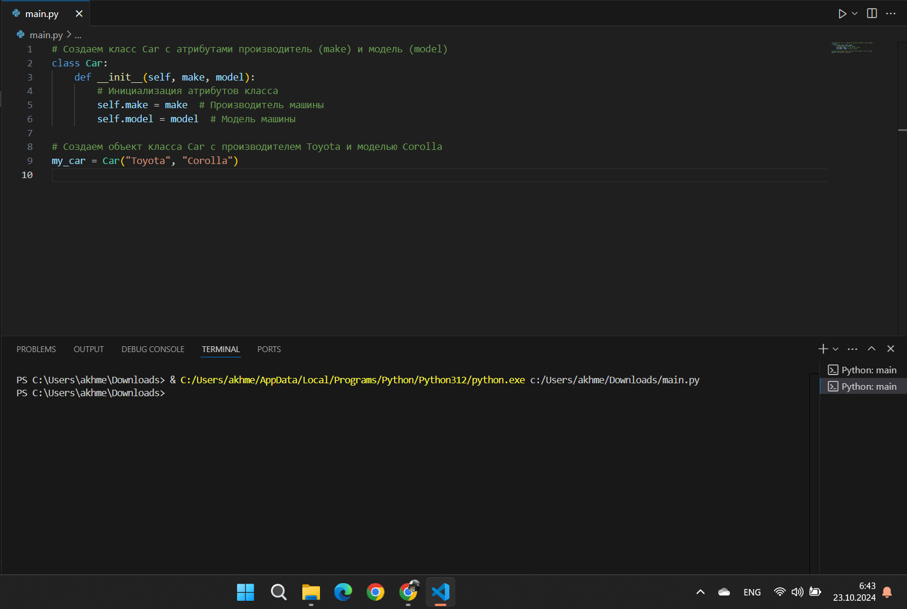
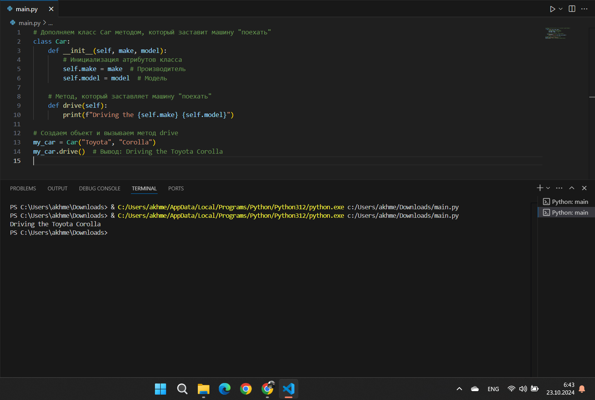
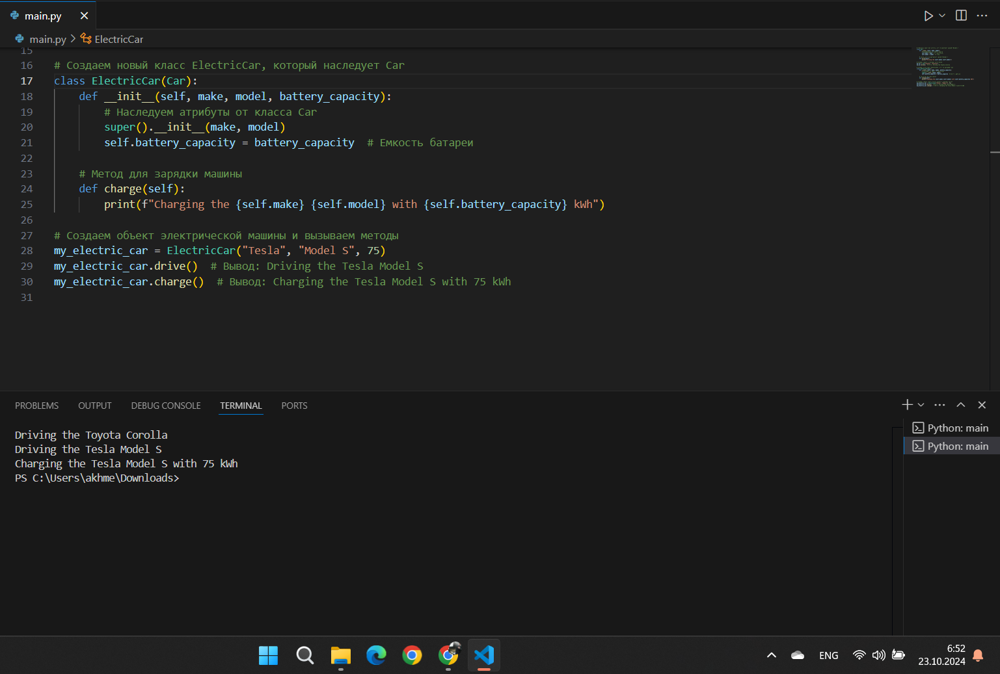
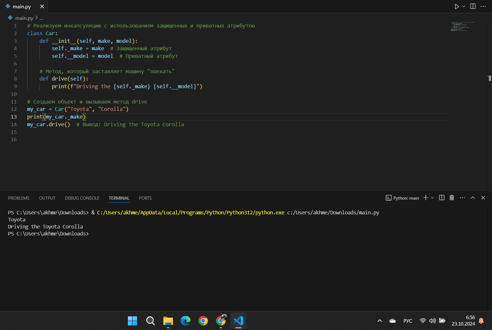
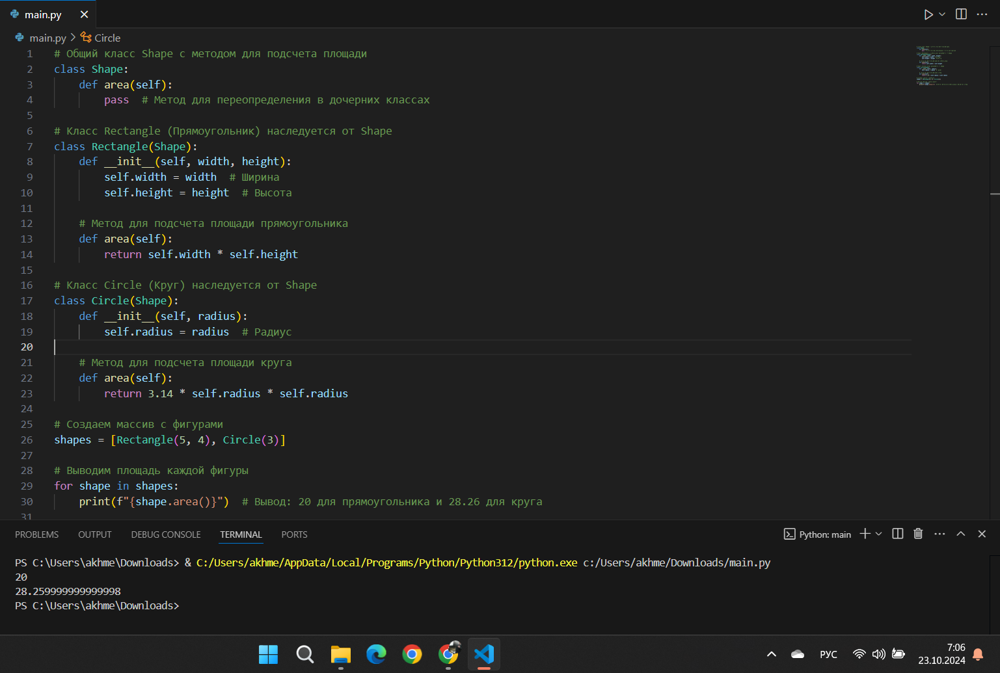
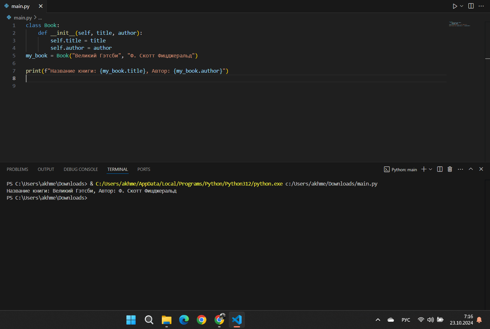

# Тема 9. ООП на Python: концепции, принципы и примеры реализации
Отчет по Теме #9 выполнил(а):
- Ахметшин Данил Эдуардович
- ИВТ-22-1

| Задание | Лаб_раб | Сам_раб |
| ------ | ------ | ------ |
| Задание 1 | + | + |
| Задание 2 | + | - |
| Задание 3 | + | - |
| Задание 4 | + | - |
| Задание 5 | + | - |
| Задание 6 | - | - |
| Задание 7 | - | - |
| Задание 8 | - | - |
| Задание 9 | - | - |
| Задание 10 | - | - |

знак "+" - задание выполнено; знак "-" - задание не выполнено;

Работу проверили:
- к.э.н., доцент Панов М.А.

## Лабораторная работа №1
### Допустим, что вы решили оригинально и немного странно познакомится с человеком. Для этого у вас должен быть написан свой класс на Python, который будет проверять угадал ваше имя человек или нет. Для этого создайте класс, указав в свойствах только имя. Дальше создайте функцию ＿ init (), а в ней сделайте проверку на то угадал человек ваше имя или нет. Также можете проверить что будет, если в этой функции указав атрибут, который не указан в вашем классе, например, попробуйте вызвать фамилию.

```python
class Ivan:
    __slots__ = ['name']
    
    def __init__(self, name): 
        if name == 'Иван':
            self.name = f"Да, я {name}"
        else:
            self.name = f"Я не {name}, a Иван"

person1 = Ivan('Алексей')
person2 = Ivan('Иван')
print(person1.name)
print(person2.name)
person2.surname = 'Петров'
```
### Результат.


## Выводы
- В этом задании реализован класс Ivan с использованием __slots__, что ограничивает список допустимых атрибутов только name.
- При создании объекта проверяется, является ли переданное имя "Иван". Если да, устанавливается сообщение "Да, я Иван", если нет — сообщение "Я не <имя>, a Иван".
- Программа демонстрирует, что нельзя динамически добавить новый атрибут surname из-за использования __slots__, что вызывает ошибку.

## Лабораторная работа №2
### Вам дали важное задание, написать продавцу мороженого программу, которая будет писать добавили ли топпинг в мороженое и цену после возможного изменения. Для этого вам нужно написать класс, в котором
### будет определяться изменили ли состав мороженого или нет. В этом классе реализуйте метод, выводящий на печать «Мороженое с {ТОППИНГ}» в случае наличия добавки, а иначе отобразится следующая фраза: «Обычное мороженое». При этом программа должна воспринимать как топпинг только атрибуты типа string.
```python
class Icecream:
    def __init__(self, ingredient=None):
        if isinstance(ingredient, str): 
            self.ingredient = ingredient
        else:
            self.ingredient = None
        
    
    def composition(self):
        if self.ingredient:
            print(f"Мороженое с {self.ingredient}")
        else:
            print('Обычное мороженое')
icecream = Icecream()
icecream.composition()
icecream = Icecream('шоколадом')
icecream.composition()
icecream = Icecream(5)
icecream.composition()
```
### Результат.


## Выводы
- Программа создает класс Icecream, который позволяет задавать ингредиент мороженого.
- В конструкторе проверяется, является ли переданный параметр строкой. Если это так, он устанавливается как ингредиент, иначе ингредиент не задается.
- Метод composition выводит состав мороженого, включая ингредиент, если он установлен, или указывает на обычное мороженое, если ингредиента нет.

## Лабораторная работа №3
### Петя - начинающий программист и на занятиях ему сказали реализовать икапсу…что-то. А вы хороший друг Пети и ко всему прочему прекрасно знаете, что икапсу…что-то - это инкапсуляция, поэтому решаете помочь вашему другу с написанием класса с инкапсуляцией. Ваш класс будет не просто инкапсуляцией, а классом с сеттером, геттером и деструктором. После написания класса вам необходимо продемонстрировать что все написанные вами функции работают.
### Также вас необходимо объяснить Пете почему на скриншоте ниже в консоли выводится ошибка.
```python
class MyClass:
    def __init__(self, value):
        self._value = value
    def set_value(self, value): 
        self._value = value
    def get_value(self):
        return self._value
    def del_value(self):
        del self._value
    
    value = property(get_value, set_value, del_value, "Cвойство value")

obj = MyClass(42) 
print(obj.get_value()) 
obj.set_value(45) 
print(obj.get_value()) 
obj. set_value(100) 
print(obj.get_value()) 
obj.del_value() 
print(obj.get_value())
```
### Результат.


## Выводы
- Программа реализует класс MyClass с инкапсуляцией через свойства (property).
- Свойство value позволяет получать (get_value), изменять (set_value) и удалять (del_value) значение атрибута _value.
- Если атрибут _value удален и при этом вызван метод get_value, программа вызовет ошибку AttributeError, поскольку _value уже не существует.
  
## Лабораторная работа №4
### Вам прекрасно известно, что кошки и собаки являются млекопитающими, но компьютер этого не понимает, поэтому вам нужно написать три класса: Кошки, Собаки, Млекопитающие. И при помощи
### "наследования" объяснить компьютеру что кошки и собаки - это млекопитающие. Также добавьте какой-нибудь свой атрибут для кошек и собак, чтобы показать, что они чем-то отличаются друг от друга.
```python
class Mammal:
    className = 'Mammal'

class Dog(Mammal):
    species = 'canine'
    sounds = 'woof'

class Cat(Mammal):
    species = 'feline'
    sounds = 'meow'

dog = Dog()
print(f"Dog is {dog.className}, but they say {dog.sounds}")
cat = Cat()
print(f"Cat is {cat.className}, but they say {cat.sounds}")
```
### Результат.


## Выводы
- В этом задании определены классы для моделирования иерархии животных.
- Базовый класс Mammal содержит общий атрибут className, а классы Dog и Cat добавляют свои уникальные атрибуты: species и sounds.
- Программа создает экземпляры классов Dog и Cat и выводит, как каждый из них идентифицируется по className и "говорит" по-своему, демонстрируя принцип наследования.

## Лабораторная работа №5
### На разных языках здороваются по-разному, но суть остается одинаковой, люди друг с другом здороваются. Давайте вместе с вами реализуем программу с полиморфизмом, которая будет описывать всю суть первого предложения задачи. Для этого мы можем выбрать два языка, например, русский и английский и написать для них отдельные классы, в которых будет в виде атрибута слово, которым здороваются на этих языках. А также напишем функцию, которая будет выводить информацию о том, как на этих языках здороваются.
### Заметьте, что для решения поставленной задачи мы использовали декоратор @staticmethod, поскольку нам не нужны обязательные параметры-ссылки вроде self.
```python
class Russian:
    def greeting(self):
        print("Привет")

class English:
    def greeting(self):
        print("Hello")

def greet(language):
    language.greeting()

ivan = Russian()
greet(ivan)
john = English()
greet(john)
```
### Результат.


## Выводы
- Программа создает два класса Russian и English, каждый из которых имеет метод greeting для вывода приветствия на своем языке.
- Функция greet принимает объект, вызывая метод greeting, что демонстрирует полиморфизм — одинаковый вызов метода для объектов разных классов с разными результатами.
- Пример показывает, как можно унифицировать взаимодействие с объектами, имеющими методы с одинаковым именем.

## Самостоятельная работа №1
### Самостоятельно создайте класс и его объект. Они должны отличаться, от тех, что указаны в теоретическом материале (методичке) и лабораторных заданиях. Результатом выполнения задания будет листинг кода и получившийся вывод консоли.

```python
class Tomato:
    # Статическое свойство со стадиями созревания
    states = {0: "Отсутствует", 1: "Цветение", 2: "Зеленый", 3: "Красный"}

    def __init__(self, index):
        self._index = index  # Динамическое свойство, уникальный индекс помидора
        self._state = 0      # Динамическое свойство, текущая стадия созревания

    # Метод для роста помидора, переход к следующей стадии
    def grow(self):
        if self._state < 3:
            self._state += 1

    # Метод для проверки зрелости помидора
    def is_ripe(self):
        return self._state == 3

    # Метод для получения текущей стадии в виде строки
    def get_state(self):
        return self.states[self._state]


class TomatoBush:
    def __init__(self, count):
        # Создаем куст с указанным количеством помидоров
        self.tomatoes = [Tomato(i) for i in range(count)]

    # Метод для роста всех помидоров на кусте
    def grow_all(self):
        for tomato in self.tomatoes:
            tomato.grow()

    # Метод для проверки, все ли помидоры созрели
    def all_are_ripe(self):
        return all(tomato.is_ripe() for tomato in self.tomatoes)

    # Метод для сбора урожая, очищаем список помидоров
    def give_away_all(self):
        self.tomatoes = []


class Gardener:
    def __init__(self, name, plant):
        self.name = name          # Имя садовника (публичное свойство)
        self._plant = plant       # Растение, за которым ухаживает садовник (защищенное свойство)

    # Метод для ухода за растением, переводит все помидоры на следующую стадию
    def work(self):
        print(f"{self.name} ухаживает за растением...")
        self._plant.grow_all()

    # Метод для сбора урожая, если все помидоры созрели
    def harvest(self):
        if self._plant.all_are_ripe():
            print(f"{self.name} собрал урожай!")
            self._plant.give_away_all()
        else:
            print(f"{self.name} предупреждает: урожай еще не созрел!")

    # Статический метод, выводящий справку по садоводству
    @staticmethod
    def knowledge_base():
        print("Справка по садоводству: ухаживайте за растениями, чтобы они росли. Сбор урожая возможен только после полного созревания.")

# Тестирование программы
Gardener.knowledge_base()  # Вызываем справку по садоводству

# Создаем куст с 3 помидорами и садовника для ухода за ним
bush = TomatoBush(3)
gardener = Gardener("Иван", bush)

# Садовник ухаживает за растением и пытается собрать урожай на каждой стадии
gardener.work()  # Переход на первую стадию
gardener.harvest()  # Проверка урожая
gardener.work()  # Переход на вторую стадию
gardener.harvest()  # Проверка урожая
gardener.work()  # Переход на третью стадию
gardener.harvest()  # Проверка урожая
gardener.work()  # Переход на четвертую стадию (все помидоры созрели)
gardener.harvest()  # Сбор урожая
```
### Тесты.


## Выводы
- Класс Tomato: Содержит состояния созревания томата и методы для его роста (grow) и проверки зрелости (is_ripe).
- Класс TomatoBush: Создает куст с несколькими помидорами и имеет методы для роста всех томатов (grow_all), проверки зрелости всех плодов (all_are_ripe) и сбора урожая (give_away_all).
- Класс Gardener: Садовник может ухаживать за кустом помидоров (work) и собирать урожай (harvest). Также есть статический метод knowledge_base() для вывода справки.

## Общие выводы по теме
В данной теме были рассмотрены основные принципы ООП: инкапсуляция, наследование, полиморфизм и абстракция. Эти концепции позволяют структурировать и упрощать код, создавая его более гибким и масштабируемым. Инкапсуляция обеспечивает защиту данных и контроль доступа к ним, наследование — повторное использование кода, а полиморфизм — универсальный интерфейс для различных классов. Абстракция помогает выделить общие свойства и упростить сложные процессы. Применение этих принципов делает программу более организованной и легкой в сопровождении.
